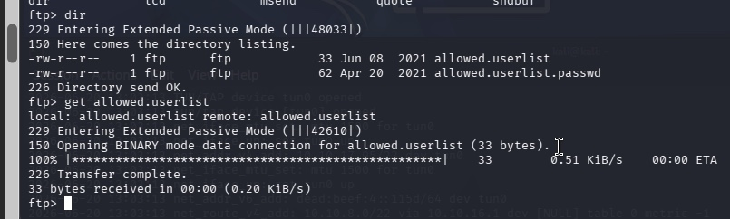
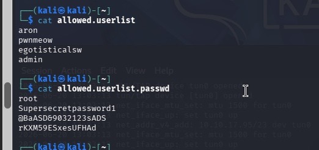
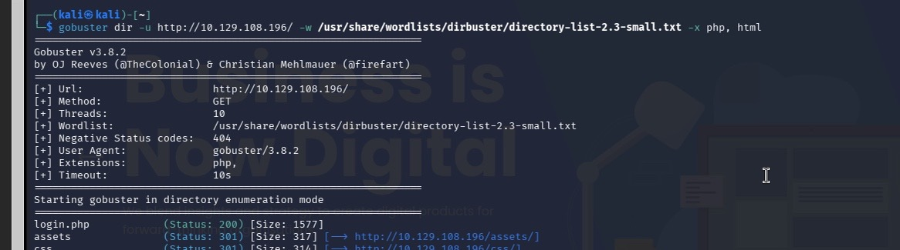
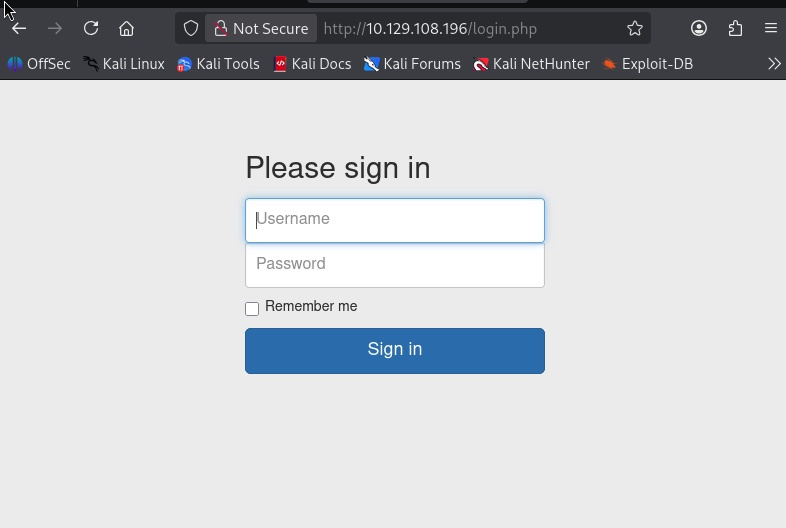
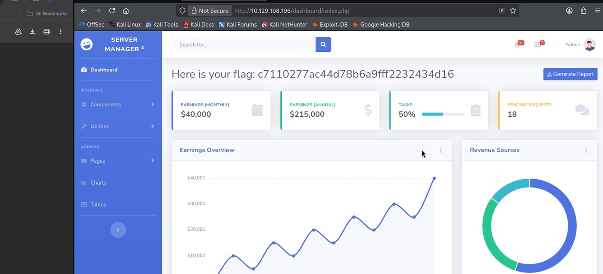

## Target: Crocodile
## Platform: HTB
## Date: 6/24/26
## Difficulty: Easy
## Tools: Wappalyzer 


### Recon 

```bash
 nmap -sC -sV 10.129.108.196
```
Scan found two ports
- 21/tcp ftp (vsftpd 3.0.3)
- 80/tcp http (Apache 2.4.41)

Connected to the ftp server 

**Enumerating FTP**

Used Dir in to list the files stored on FTP 



Downloaded both files using the get command 

Used cat to reveal the contents of the exposed files 



Attempted to use obtained credentials to gain elevated access, but was denied

**Website Investigation**

Investigated the http server listed on the initial scan

http://10.129.108.196

Used Wappalyzer to analyze the technology used to create the website 




### Exploitation

Used Gobuster to discover hidden and hardly accessible pages and directories. 

```bash
gobuster dir -u 10.129.108.196/ -w /usr/share/wordlists/dirbuster/directory-list-2.3-small.txt -x php, html
```


Found page login.php. 
Navigated to URL http://10.129.108.196/login.php



### Initial Access

Authenticated as admin using exposed credentials found on ftp server 

## Flag Retrieval

Retrieved flag on homepage 



