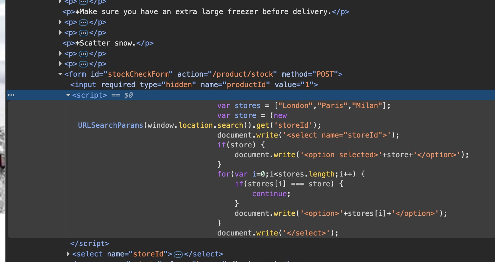
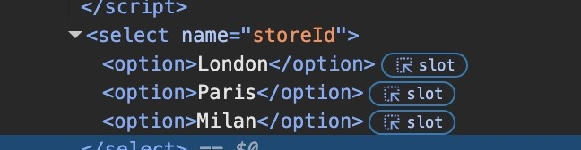

## Target: Port Swigger Web Security Academy - Shopping Application
## Platform: PortSwigger
## Date: 08/22/26
## Difficulty: Practitioner (DOM XSS document.write()) Apprentice (jQuery anchor href, jQuery hashchange)
## Tools: 
- Browser 
- DevTools 


### DOM XSS in `document.write` sink using source `location.search` inside a select element 

Navigate to product page and observe the page has a stock checker functon. 


#### Identify the Source and Sink 

Inspecting the live DOM on Chrome DevTools, we find that a JS script is responsible for implementing and updating the form's location.



A statically defined array containing the locations "London", "Paris", "Milan" is declared. A for loop then iterates over the array to generate an `<option>` for each element. The Javascript writes these locations using `document.write()`. Further down, we see the result of the Javascript execution from the `<select>` and the location `<option>` elements.




This output context will be important for successfully injected the future payload.

Directly below `stores` array we find the source 

```javascript
var store = (new URLSearchParams(window.location.search)).get('storeId');

```

`window.location.search` extracts the query string from the URL. `URLSearchParams` then parses that query string, allowing `.get('storeId')` to retrieve the value associated with the `storeId` parameter. The value associated with that parameter is then saved to the variable `store`. 

We then identify the sink 

```javascript
document.write('<select name="storeId">');

if (store) {
    document.write('<option selected>'+store+'</option>');
}
```

The `document.write()` sink takes the extracted parameter input `store` and writes it to the web page without sanitization.


#### Prove Input reaches Sink 

First thing to test is whether attacker-controlled input from the URL query reaches the `document.write()` sink and is reflected in the dropdown option.


#### Payload Injection


### DOM XSS in jQuery anchor href attribute sink using location.search source

### DOM XSS jQuery in selector sink using a hashchange event 


