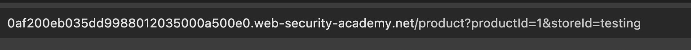
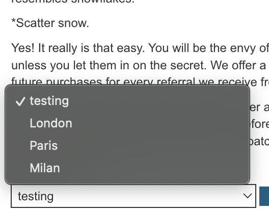
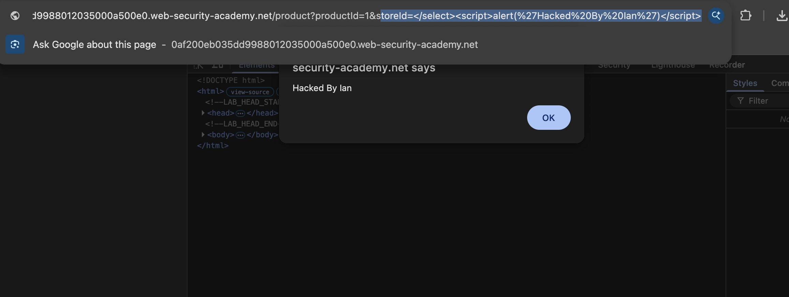
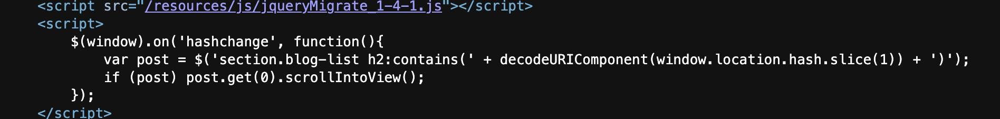
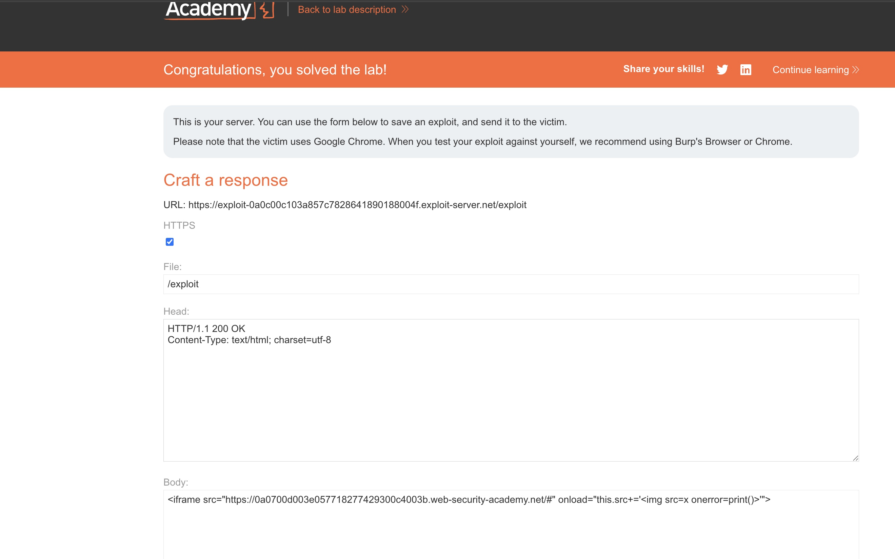

## Target: Port Swigger Web Security Academy - Shopping Application
## Platform: PortSwigger
## Date: 08/22/26
## Difficulty: Practitioner (DOM XSS document.write()) Apprentice (jQuery anchor href, jQuery hashchange)
## Tools: 
- Browser 
- DevTools 


### DOM XSS in `document.write` sink using source `location.search` inside a select element 

Navigate to the product page and observe the page has a stock checker functon. 


#### Identify the Source and Sink 

Inspecting the live DOM in Chrome DevTools, we find that JavaScript is responsible for implementing and updating the form's location.


A statically defined array containing the locations "London", "Paris", and "Milan" is declared. A for loop then iterates over the array to generate an `<option>` for each element. The JavaScript writes these locations using `document.write()`. Further down, we see the result of the JavaScript execution in the form of the `<select>` and the location `<option>` elements.


This output context will be important for successfully injecting the payload in the future.

Directly below `stores` arra, we find the source:

```javascript
var store = (new URLSearchParams(window.location.search)).get('storeId');

```

`window.location.search` extracts the query string from the URL. `URLSearchParams` then parses that query string, allowing `.get('storeId')` to retrieve the value associated with the `storeId` parameter. The value associated with that parameter is then saved to the variable `store`. 

We then identify the sink: 

```javascript
document.write('<select name="storeId">');

if (store) {
    document.write('<option selected>'+store+'</option>');
}
```

The `document.write()` sink takes the extracted parameter input `store` and writes it to the web page without sanitization.


#### Prove Input Reaches Sink 

The first thing to test is whether attacker-controlled input from the URL query reaches the `document.write()` sink and is reflected in the dropdown option.



We then verify successful insertion through viewing the location dropdown.


> Insertion Confirmed 


#### Payload Injection

After confirming successful injection, we craft and inject a payload that calls the `alert` function. As noted earlier, the sink `document.write()` places input within an `<option>` element inside a `<select>` element. To prevent the HTML parser from treating the injected JavaScript as content within the restricted context, we need to break out of the context using a closing `</select>` tag first. 

```javascript 
</select><script>alert('Hacked By Ian`)</script>
```


> Successful injection execution reflected in the page


#### Room Completion 


### DOM XSS in jQuery anchor href attribute sink using location.search source


### DOM XSS `jQuery` in selector sink using a hashchange event 

Presented with a Blog Home page 


#### Identify the Source and Sink 

Inspecting the page source, we find a JavaScript function. 




This function works by using jQuery's selector function to auto-scroll to a post, whenever there is a hashchange. Upon inspection, we see the source `'window.location.hash()` which retrieves the user fragment input. The sink in this function is the jQuery `$()` function call, which can be utilized to write HTML to the document. 

In order to take advantage of the sink we have to trigger a `hashchange` event. We can do this by using `<iframe>`, specifically with an onload trigger. 

#### Payload Injection && Confirmation

We begin by injecting an <iframe> into the body of the exploit server. The purpose of the <iframe> is to load the vulnerable application's home page into the browser of the victim. By initially setting the URL fragment to #, we provide the baseline that will be appended too. 

```javascript
<iframe src="https://0a0700d003e057718277429300c4003b.web-security-academy.net/#" onload="this.src+=''">
```

When the <iframe> finishes loading, browser executes the `onload`, appending a  tag onto the existing `src` value. Due to the original URL ending in `#` the appended HTML becomes apart of the URL Fragment. 

https://0a0700d003e057718277429300c4003b.web-security-academy.net/#

The modification to the URL fragment triggers the hashchange event, causing it's JavaScript to process the attacker control input located within `location.hash`. The application retrieves the attacker-controlled input from `location.hash` removes the leading `#` using `slice(1)`, and decodes it. The resulting value is then concatenated into a string that is passed into jQuery's `$()` function.

The string becomes 

```javascript

$('section.blog-list h2:contains()')
```
 Older version of jQuery acted as both a CSS-selector processing and an HTML string -parsing. The developer in this scenario intended for the entire string to be treates a selector query, but forgot the secondary functionality. jQuery sees the  tag switches to it's HTML parser mode and instaniates new DOM element in memory. The browser attemmpts to fetch the image source, which fails because x is not a reachable source. This triggers the `onerror`, leading the `print()` function to fire.

We verify the payload functionality 


> `print()` function executes successfully 

#### Deliver Exploit to Victim

We deliver the exploit to victim


> Lab solved banner 


