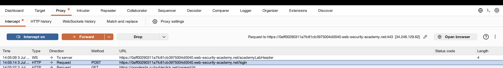
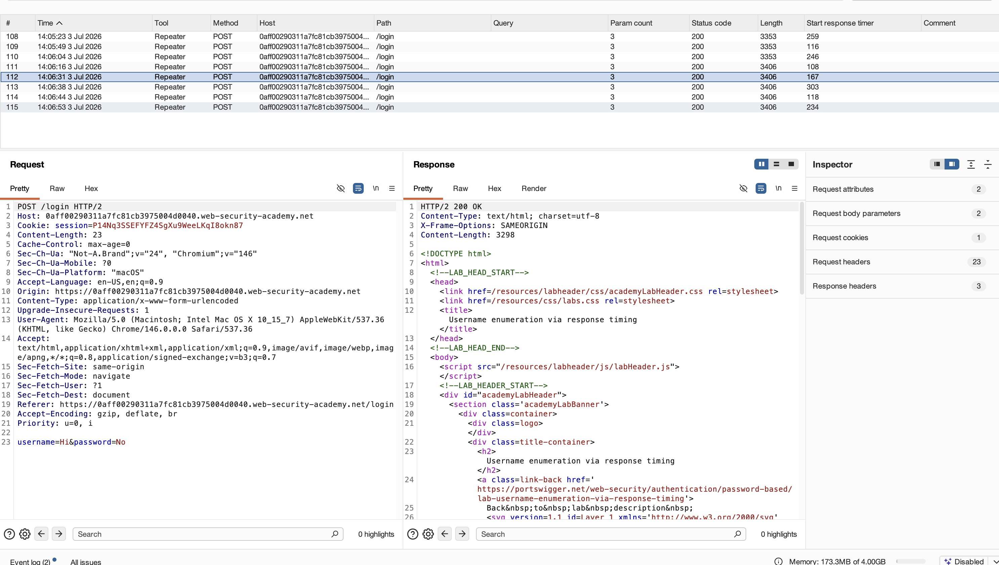
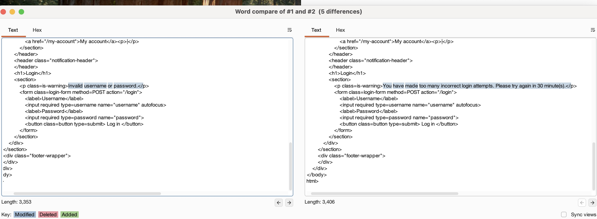
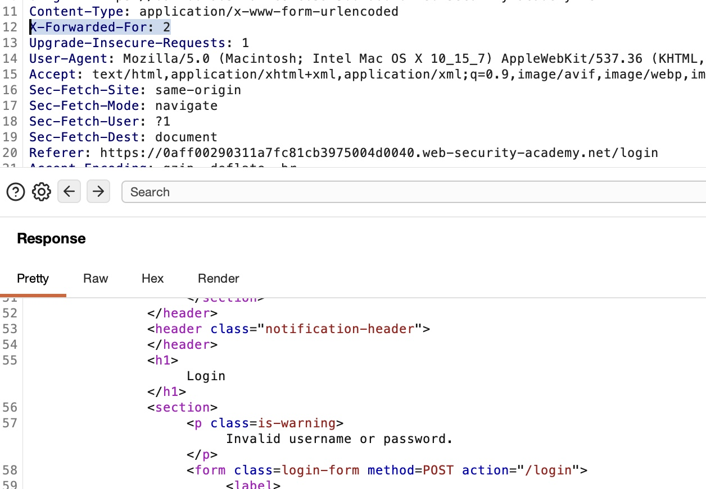
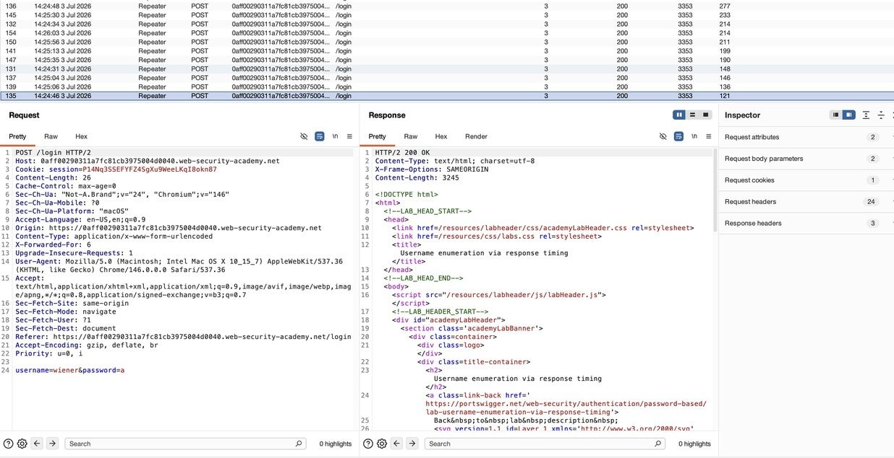
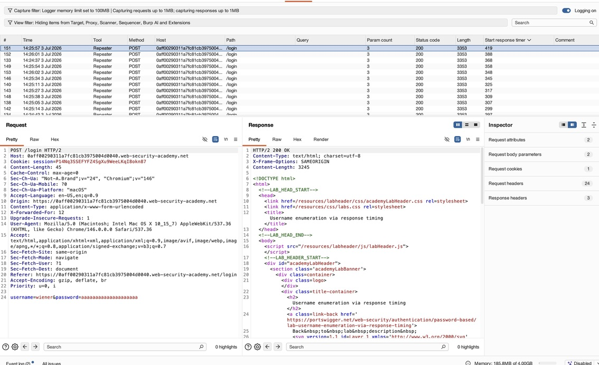

## Target: Authentication system with IP-Based brute protection
## Platform: PortSwigger Web Security Academy 
## Date: 7/6/2026
## Difficulty: Apprentice 
## Tools: 
- Burp Suite Intruder 
- Burp Suite Repeater 
- Burp Suite Proxy 
- Burp Suite Comparer

---

### Recon 

Captured a "POST /login" to target using Burp Proxy

- Sent the Request to Repeater for manual testing 
- Observed that repeated failed logins triggerted the application IP-based brute-force protection
- Reviewed Requests in Logger and noticed two distinct response lengths 

  - **3353 bytes** – standard failed login response.
  - **3406 bytes** – response returned after the IP address was temporarily blocked.

- Sent both to Comparer to identify the specific differences

- Verified 'X-Forwarded-For' was editable and could bypass IP-based brute-force protection

- Continued Manually testing username and password combinations in repeater, observing invalid usernames returned similar response times 
- Experimented with correct username and differing password lengths
    - 1 a -> 5 a's -> 10 a's -> 20 a's
- Observed longer passwords had longer average response time 
    - 4 of the top 5 highest response times were 20 a's
    - 4 of the top 5 lowest response times were 1 a or 5 a's

**Low Response Times**

**High Response Times**

Increased response time suggested that the application performed password verification after receiving a valid username. Longer password consistently resulting in longer response times indicated that the authentication routine required additional processing as the length of the password increased.

This observation indicated that password verification time was measurable and could be used for further username enumeration

 

---

### Exploitation

---

### Key Takeaway

