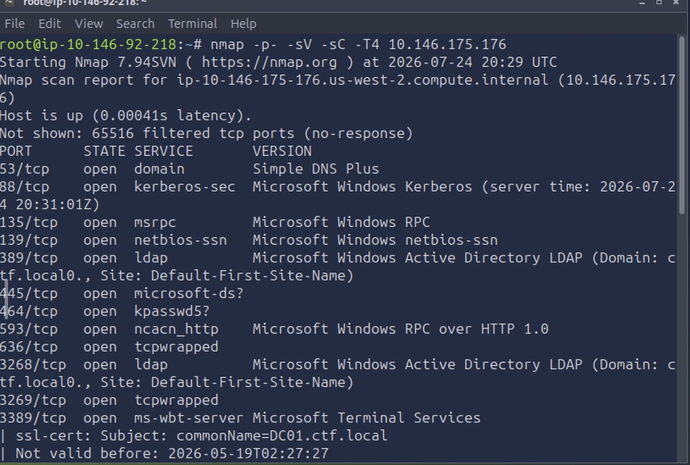
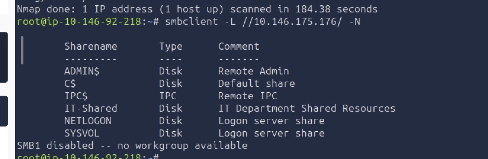
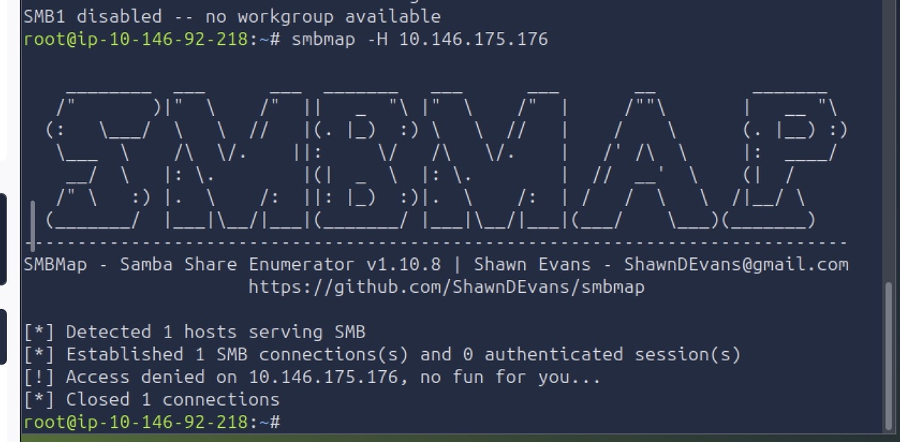
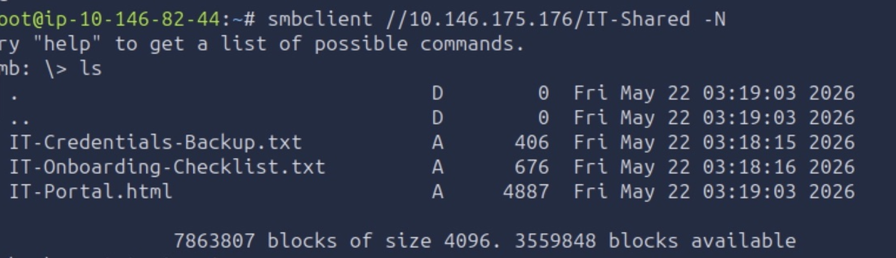
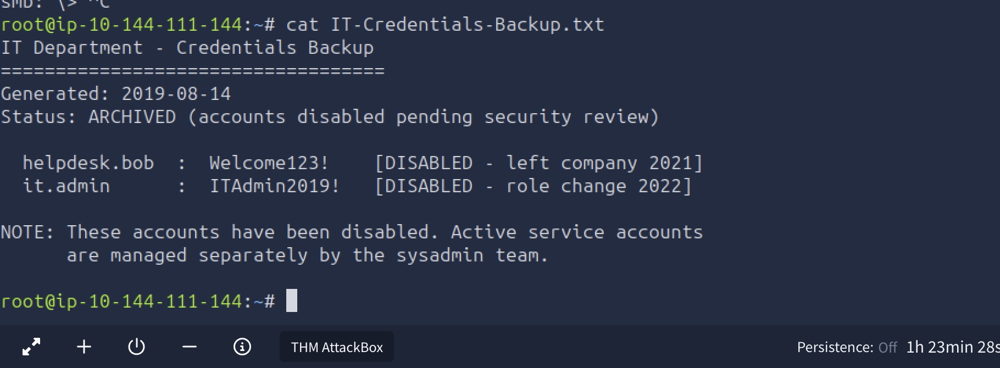
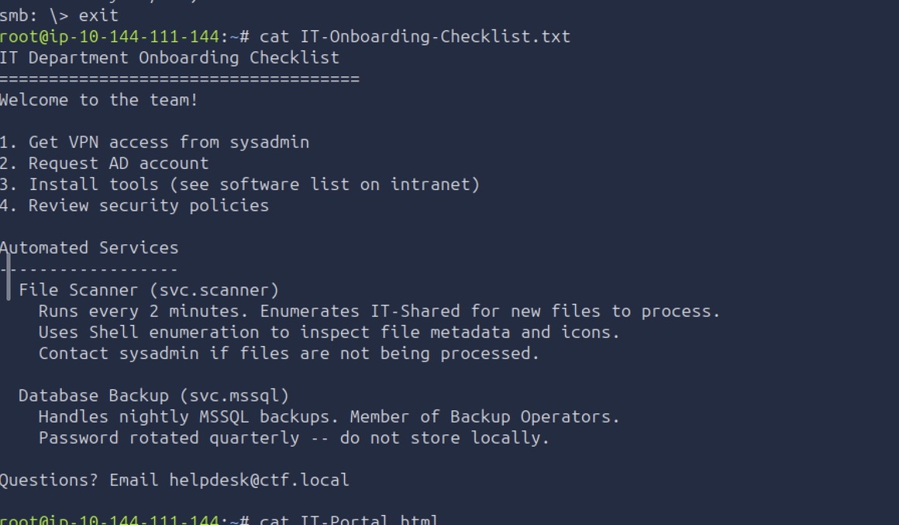

## Target: DC01.ctf.local (10.144.x.x — IP varied across sessions due to lab restarts)
## Platform: TryHackMe — "Proxy"
## Date: July 24-25, 2026
## Difficulty: Medium
## Tools: nmap, smbclient, netexec (nxc), Responder, Impacket suite (GetUserSPNs.py, getST.py, smbexec.py, secretsdump.py), hashcat

---

**NOTE:** This engagement spanned across multiple sessions due to lab timeout limits, resulting in differently assigned attacker/machine IP addresses across screenshots 

### Recon

We begin by running an initial `nmap` scan on the target machine to enumerate TCP ports. We explicitly run -sV for service version detection, and -sC for additional service details, -p- for a full scan, and -T4 for a more aggresive scan 

```bash
nmap -p- -sV -sC -T4 10.146.175.176
```



Full port scan revealed a Windows Domain Controller (`DC01.ctf.local`, domain `ctf.local`) — Kerberos (88), LDAP (389/3268), SMB (139/445), RDP (3389)


Anonymous SMB access confirmed via `smbclient` and listed shares

```bash
smbclient -L //10.146.175.176 -N
```

SMB revealed 6 shares



Used `smbmap` to enumerate share permissions 

```bash
smbmap -H 10.146.175.176
```

Permission access details were denied 



Accessed `IT-Shared` share via `smbclient`



`IT-Shared` share held three files
- `IT-Credentials-Backup.txt`
- `IT-Onboarding-Checklist.txt`
- `IT-Portal.html`

`IT-Credentials-Backup.txt` contained two pairs of credentials, explicitly marked as disabled. Notably, the file does reveal a predictable password pattern (Uppercase + Lowercase + Number + Special Character)




`IT-Onboarding-Checklist.txt` exposed sensative information, notably about a a service named `svc.scanner`. This automated service periodically reads `IT-Shared` every two minutes to inspect file metadata and icons. 




---

### Exploitation


---

### Post Exploitation


---

#### Key Takeaway