Template 
## Target: Recruit
## Platform: TryHackMe
## Date: 
## Difficulty: Medium
## Tools: 
- gobuster

---

### Recon 

We begin by performing a port scan on the target machine

```bash
nmap -sV 10.145.183.53
```

Port scan reveals a running web service operating on port 80. We investigate further by visiting the servers address on our browser. 

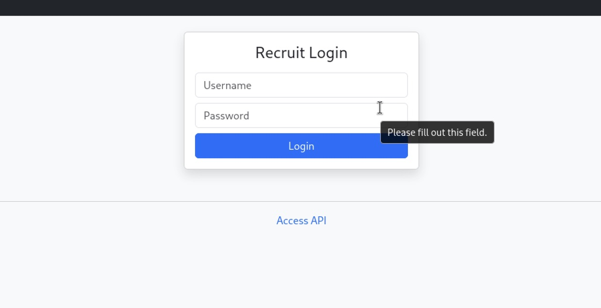

We are presented with a login form after navigating to the address. Below the login form, we see a hyperlink titled "Access API"

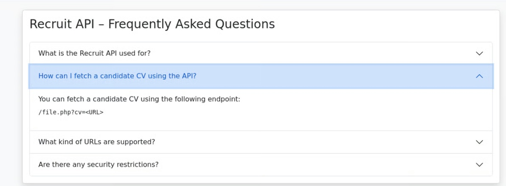

It appears the endpoint `file.php` accepts a `cv` URL parameter and retrieves the resource specified. Because the server makes a request based on a user-supplied URL, this makes the endpoint an interesting target for attempting to access resources that should otherwise be inaccessible. 


#### Directory Enumeration

Continuing our web server reconnaissance, we use `Gobuster` to enumerate hidden files and directories.

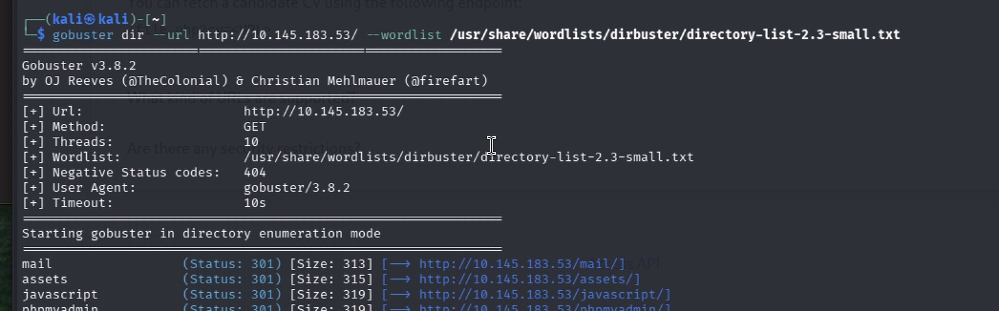
> Outputs shows intriguing pages such as `mail`, `assets` and `phpmyadmin`

We begin by returning to the browser and visiting the `mail` page that was discovered in our `gobuster` scan

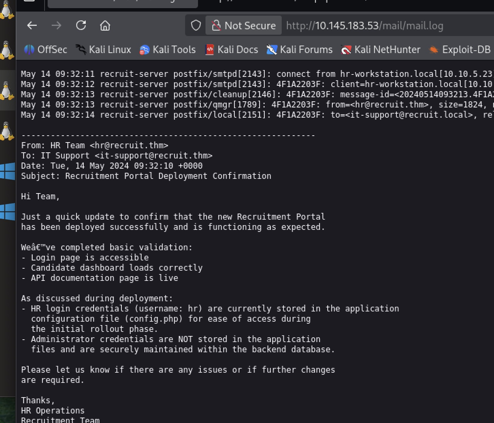

The `/mail` directory revealed a `mail.log` file containing information about the HR account. The log disclosed the username hr and indicated that the corresponding credentials could be found in `config.php`.

This gave us two useful pieces of information: a valid application username and a specific configuration file worth targeting. Since config.php commonly contains application configuration and credential material, I treated it as a high-value target.


---

### Exploiting the Access API 


We return to the `file.php` lead we investigated earlier. The endpoint accepts a URL through the `cv` parameter, causing the server to retrieve the specified resource. I began by manually probing the endpoint with arbitrary values, followed by testing HTTP and HTTPS URI schemes. During my testing I encountered an error stating "only local files are allowed".

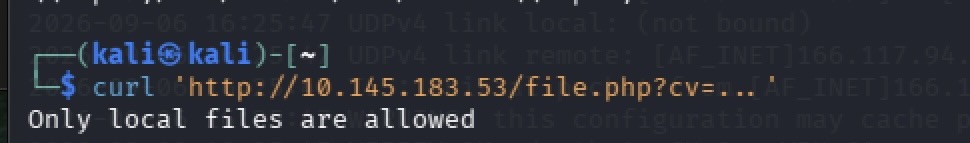

 This error changed my approach and I began looking for ways in which a local file could be represented as a URI. The `file://` URI scheme is used to locate and access files on the local file systems, which made it a fitting candidate given the applications error response.

 We then sent a GET request to the `file.php` endpoint, specifying `config.php` as the target resource using the `cv` parameter.


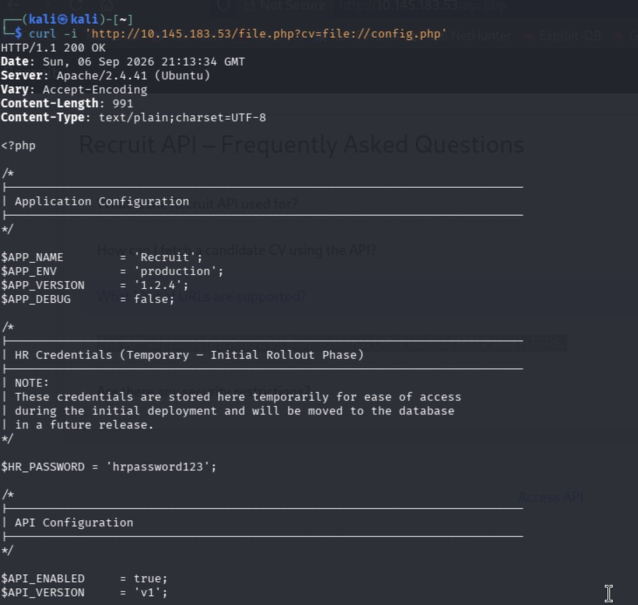

The GET request returned a `200 OK` status confirming that the resource was successfully retrieved. The response body contained the contents of `config.php`, including the HR credentials.

Using the obtained credentials, we return to the HR portal and login

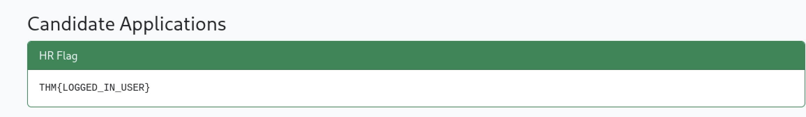
> Successful login attempt and obtained the first flag  - THM {LOGGED_IN_USER}

## Privilege Escalation

Inside of the HR portal is a search page that takes user input displays corresponding existing candidate applications. 

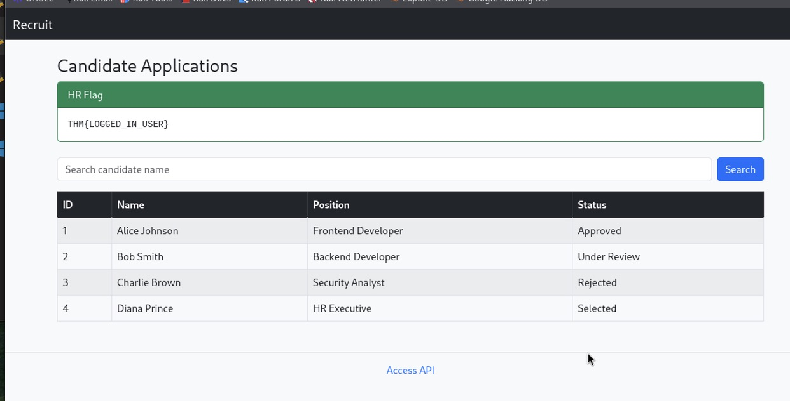

It appears that the data is being fetched from the backend database, making it a possible candidate for SQL injection. We begin by testing the feasibility of SQL injection through manually probing the search field. We want to answer whether or not input is being injected into the SQL query build. 

We begin detection testing by entering a single quote `'` into the search field. 

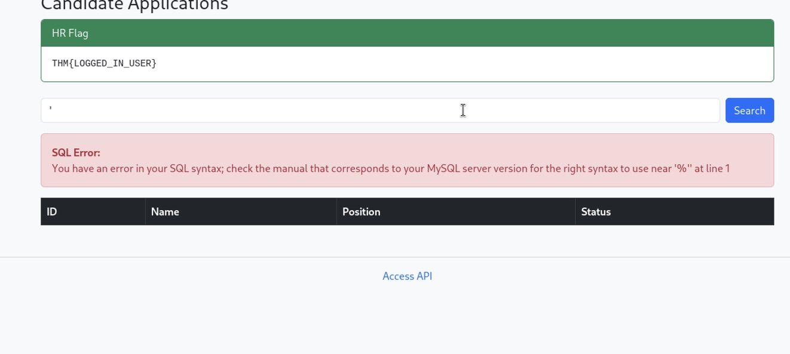
> Application returns database error (SQL) that disclosed `MySQL` as the backend database management system

The application existing query seems to retreive database records and reflect those back into the webpage response. In this case, a `UNION-based SQLi injection` is an attractive point of attack. We wish to see if UNION injection results can be merged into the application normal result set and displayed. 

To perform a successful `UNION` injection we must first determine the amount of columns returned in applications original query. This is because in order for the database to accept the `UNION`, the two queries need to return the same amount of columns.


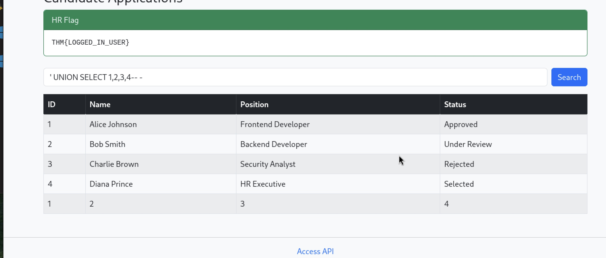
> Column enumeration confirms the column count as `4`

With the column count confirmed we can attempt to purse `UNION-based database extraction` using `MySQL's` metadata tables 


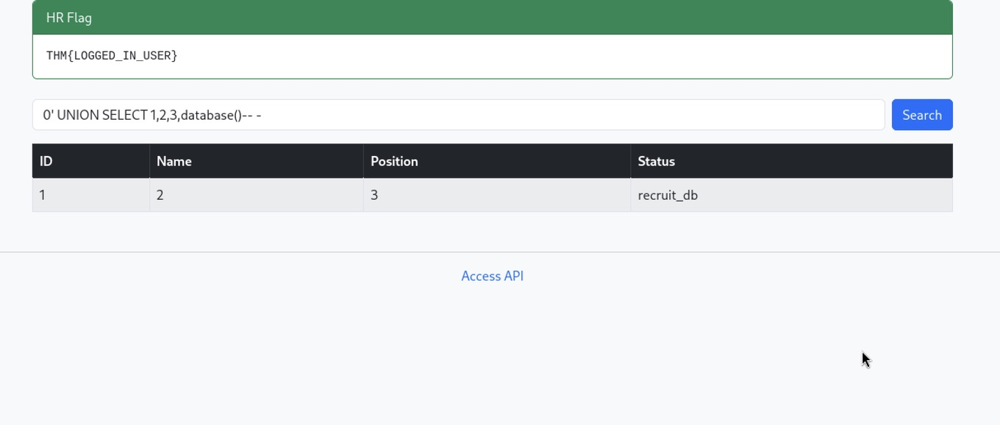
> Database name is disclosed as `recruit_db`

In MYSQL, database metadata is provided through a system database called `INFORMATION_SCHEMA`. Using SELECT queries on `INFORMATION_SCHEMA` we can retrieve information about databases, tables, columns, and other database objects. Now that we have the database we can use it to retrieve the existing tables within it. 

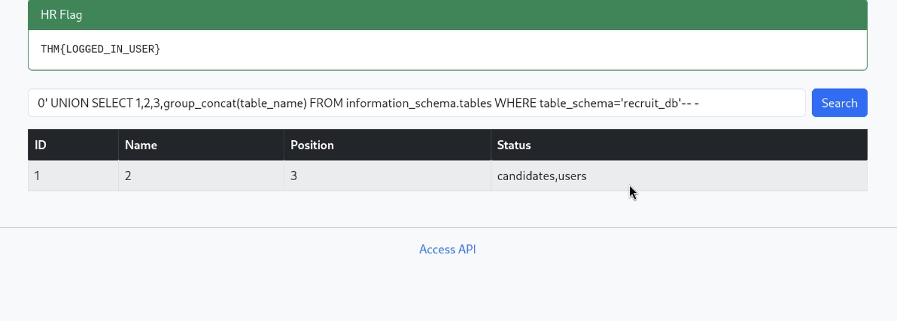
> Tables `candidates` and `users` are confirmed


#### Manual UNION-Based SQL Injection


### Key Takeaway
